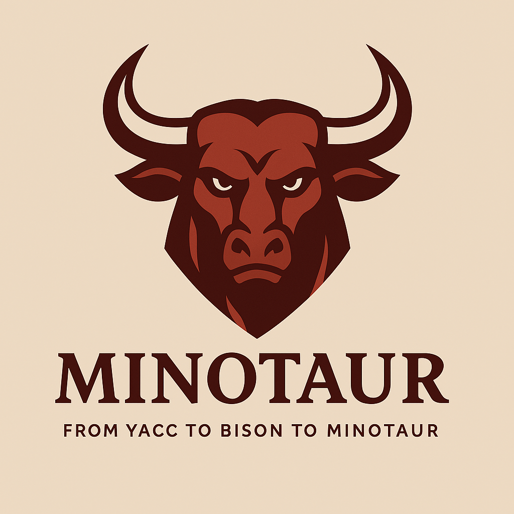

# Minotaur - Advanced Compiler-Compiler Platform

[](https://github.com/DevelApp-ai/Minotaur/actions/workflows/ci-cd-enhanced.yml)
[](https://www.nuget.org/packages/Minotaur)
[](https://www.gnu.org/licenses/agpl-3.0)



Minotaur is a powerful compiler-compiler platform that revolutionizes grammar development through automated grammar generation, error-driven refinement, and comprehensive language analysis capabilities.

## 🚀 Key Features

### Automated Grammar Generation
- **Source Code Analysis**: Automatically analyzes existing codebases to extract grammar patterns
- **Token Pattern Recognition**: Identifies keywords, operators, literals, and structural elements
- **Syntax Structure Discovery**: Discovers expression precedence, statement types, and control flow patterns
- **Error-Driven Refinement**: Uses parsing errors to iteratively improve grammar accuracy

### Advanced Language Support
- **Context-Aware Processing**: Leverages advanced context analysis for precise grammar generation
- **Multi-Language Support**: Handles diverse programming languages and domain-specific languages
- **Embedded Grammar Support**: Processes languages embedded within other languages (e.g., JavaScript in HTML)
- **Grammar File Creation Guide Compliance**: Outputs standard-compliant grammar files

### Interactive Development Environment
- **Command-Line Interface**: Comprehensive CLI for grammar generation, validation, and testing
- **Real-Time Progress Tracking**: Monitor grammar generation progress with detailed metrics
- **Quality Assessment**: Built-in validation and quality scoring for generated grammars
- **Comprehensive Testing**: Extensive test suites for grammar validation and refinement

## 📦 Installation

```bash
dotnet add package DevelApp.Minotaur
```

## 🔧 Quick Start

### StepParser Integration

```csharp
using Minotaur.Parser;
using Minotaur.Plugins;
using Minotaur.Core;

// Create integration with plugin manager
using var integration = new StepParserIntegration();

// Parse source code to cognitive graph
var sourceCode = "var x = 42;";
var cognitiveGraph = await integration.ParseToCognitiveGraphAsync(sourceCode);

// Edit the graph
cognitiveGraph.AddChild(new TerminalNode("comment", "// Generated"));

// Unparse back to code
var csharpPlugin = integration.PluginManager.GetPlugin("csharp");
var regeneratedCode = await csharpPlugin.UnparseAsync(cognitiveGraph);
```

### Plugin System

```csharp
using Minotaur.Plugins;

// Built-in language plugins
using var pluginManager = new LanguagePluginManager();

// Get plugin by language
var csharpPlugin = pluginManager.GetPlugin("csharp");
var jsPlugin = pluginManager.GetPlugin("javascript");
var pythonPlugin = pluginManager.GetPlugin("python");

// Get plugin by file extension
var plugin = pluginManager.GetPluginByExtension(".cs");

// Generate backend rules for compiler-compiler
var backendRules = await csharpPlugin.GenerateCompilerBackendRulesAsync();
Console.WriteLine($"Generated {backendRules.GenerationRules.Count} rules");
```

## 🏗️ Architecture

### Core Components

- **StepParserIntegration**: Integration with DevelApp.StepParser for parsing
- **LanguagePluginManager**: Runtime plugin discovery and management
- **GraphUnparser**: Core unparsing engine for code generation
- **CognitiveGraphNode**: Base node type for cognitive graph representation
- **GrammarGenerator**: Automated grammar discovery and generation
- **SymbolicAnalysisEngine**: Advanced code analysis and verification

### Architectural Separation

- **StepParser**: Handles ALL parsing, grammar, and syntax (single source of truth)
- **Plugins**: Handle unparsing and compiler backend generation ONLY
- **Zero-Copy Integration**: Seamless data flow between parsing and unparsing

## 📊 Implementation Status

- ✅ **StepParser Integration** - Parse source code to cognitive graphs
- ✅ **111 Comprehensive Unit Tests** (100% passing)
- ✅ **Multi-Language Plugin System** - C#, JavaScript, Python, LLVM support
- ✅ **Graph Unparsing** - Generate code from cognitive graphs
- ✅ **Compiler Backend Rules** - Generate backend code generation rules
- ✅ **Grammar Generation** - Automated grammar discovery and generation
- ✅ **Symbolic Analysis** - Advanced code analysis capabilities
- ✅ **Production NuGet Dependencies**

## 🧪 Testing

```bash
# Run all tests
dotnet test src/Minotaur.sln

# Run with coverage
dotnet test src/Minotaur.sln --collect:"XPlat Code Coverage"
```

## 🖥️ Desktop Application

Minotaur is available as a native Linux desktop application using Electron:

```bash
cd src/Minotaur.UI.Electron
npm install
npm run dev
```

Features:
- Native Linux application (AppImage, deb, rpm packages)
- Integrated Blazor UI with automatic server management
- Full keyboard shortcuts and menu integration
- Native file dialogs for grammar files
- Cross-platform support (x64, arm64)

See [Phase 2 & 3 Implementation](./PHASE_2_3_IMPLEMENTATION.md) for details.

## 📚 Documentation

- [Grammar Generation Guide](./src/Minotaur/GrammarGeneration/README.md)
- [UI Flow Documentation](./docs/ui-screenshots/UI_FLOW.md) - Comprehensive guide to all UI pages with screenshots
- [Code Development Guide](./docs/ui-screenshots/CODE_DEVELOPMENT_GUIDE.md) - Using Minotaur for application code analysis
- [Implementation Status](./docs/ui-screenshots/IMPLEMENTATION_STATUS.md) - Track progress of visualization features
- [Phase 2 & 3 Implementation](./PHASE_2_3_IMPLEMENTATION.md) - Desktop application implementation
- [Electron Integration Guide](./src/Minotaur.UI.Electron/INTEGRATION_GUIDE.md) - Blazor-Electron integration
- [GAP Analysis](./GAP_Analysis_StepParser_Implementation.md)
- [Technical Design Documents](./docs/)

## 🔗 Dependencies

### Core Dependencies
- [DevelApp.CognitiveGraph 1.0.2](https://www.nuget.org/packages/DevelApp.CognitiveGraph/) - Includes simplified GraphQL and fluid interface for high-speed integrations
- [DevelApp.StepLexer 1.9.0](https://www.nuget.org/packages/DevelApp.StepLexer/)
- [DevelApp.StepParser 1.9.0](https://www.nuget.org/packages/DevelApp.StepParser/)
- [DevelApp.RuntimePluggableClassFactory 2.0.1](https://www.nuget.org/packages/DevelApp.RuntimePluggableClassFactory/)

## 📄 License

This project is licensed under the GNU Affero General Public License v3.0 (AGPL-3.0) - see the [LICENSE](LICENSE) file for details.

**Special Exception for Generated Output**: The copyright owner of Minotaur grants you permission to link, compile, or otherwise combine the output of Minotaur with your own code and distribute the resulting combined work under terms of your choice. This exception applies to any files generated by Minotaur's code and grammar generation facilities.

## 🤝 Contributing

Contributions are welcome! Please feel free to open issues or submit pull requests.

## 🏷️ Releases

- **v1.0.0**: Initial release with complete Minotaur implementation
- **v1.0.0-preview**: Pre-release versions for testing

## 📈 Roadmap

### Completed ✅
- Core compiler-compiler functionality
- StepParser integration
- Multi-language plugin system
- Grammar generation and analysis
- Blazor-based web UI
- **Phase 2: Project loading with real-time progress**
- **Phase 3: Linux Electron desktop application**

### In Progress 🚧
- Enhanced IDE integration
- Additional language plugins
- Performance optimizations

### Planned 📋
- MAUI mobile applications (iOS, Android)
- Advanced visualization features
- Extended documentation
- Cloud-based grammar sharing