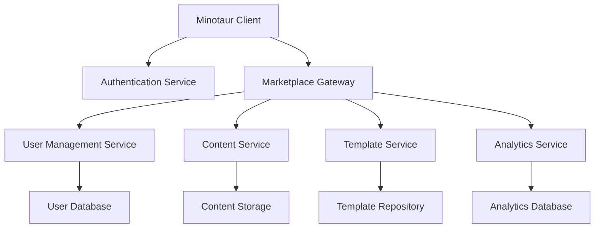
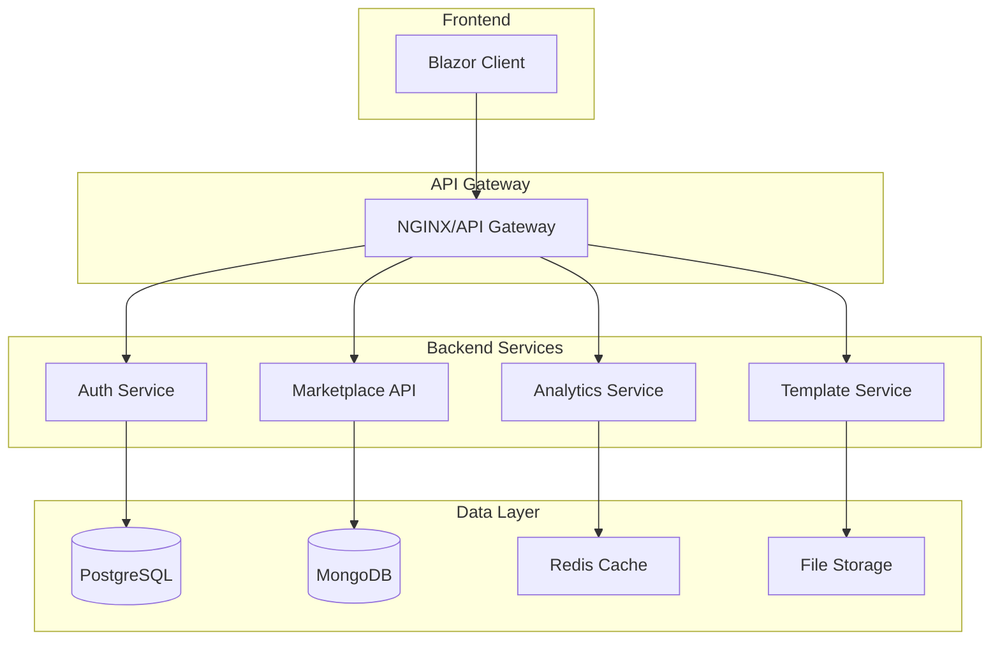

# Minotaur Marketplace Integration Technical Design Specification

## Executive Summary

This document outlines the comprehensive technical design for integrating Minotaur with a full-featured marketplace platform that supports user authentication, code templates (beyond pipeline templates), and a complete ecosystem for grammar-based development tools.

## 1. Architecture Overview

### 1.1 System Components



### 1.2 High-Level Architecture

**Frontend (Blazor Client)**
- Authentication components and user session management
- Marketplace browsing and search interface
- Code template editor and preview system
- Installation and dependency management UI

**Backend Services**
- **Authentication & Authorization Service**: OAuth2/OpenID Connect integration
- **Marketplace API Gateway**: Rate limiting, request routing, and API versioning
- **Content Management Service**: Grammar, transpiler, and template storage
- **User Management Service**: Profiles, preferences, and subscription management
- **Analytics Service**: Usage tracking, popularity metrics, and recommendations

**Data Layer**
- **User Database**: PostgreSQL for user accounts and preferences
- **Content Database**: MongoDB for marketplace items and metadata
- **File Storage**: Azure Blob Storage / AWS S3 for template files and packages
- **Search Index**: Elasticsearch for fast content discovery

## 2. Authentication & User Management

### 2.1 Authentication Flow

```csharp
public class AuthenticationService
{
    private readonly HttpClient _httpClient;
    private readonly ITokenService _tokenService;
    private readonly ILogger<AuthenticationService> _logger;

    public async Task<AuthenticationResult> LoginAsync(LoginRequest request)
    {
        var response = await _httpClient.PostAsJsonAsync("/auth/login", request);
        
        if (response.IsSuccessStatusCode)
        {
            var tokenResponse = await response.Content.ReadFromJsonAsync<TokenResponse>();
            await _tokenService.StoreTokensAsync(tokenResponse);
            
            return AuthenticationResult.Success(tokenResponse.User);
        }
        
        return AuthenticationResult.Failed(await response.Content.ReadAsStringAsync());
    }

    public async Task<bool> IsAuthenticatedAsync()
    {
        var token = await _tokenService.GetAccessTokenAsync();
        return !string.IsNullOrEmpty(token) && !await _tokenService.IsTokenExpiredAsync(token);
    }
}

public class AuthenticationResult
{
    public bool IsSuccess { get; set; }
    public string? ErrorMessage { get; set; }
    public UserProfile? User { get; set; }
    
    public static AuthenticationResult Success(UserProfile user) =>
        new AuthenticationResult { IsSuccess = true, User = user };
        
    public static AuthenticationResult Failed(string error) =>
        new AuthenticationResult { IsSuccess = false, ErrorMessage = error };
}
```

### 2.2 User Profile Management

```csharp
public class UserProfile
{
    public string Id { get; set; } = "";
    public string Username { get; set; } = "";
    public string Email { get; set; } = "";
    public string DisplayName { get; set; } = "";
    public string? AvatarUrl { get; set; }
    public DateTime CreatedAt { get; set; }
    public DateTime LastLoginAt { get; set; }
    public UserSubscription Subscription { get; set; } = new();
    public UserPreferences Preferences { get; set; } = new();
    public List<string> Roles { get; set; } = new();
    public Dictionary<string, object> Metadata { get; set; } = new();
}

public class UserSubscription
{
    public string Plan { get; set; } = "free"; // free, pro, enterprise
    public DateTime? ExpiresAt { get; set; }
    public int DownloadsRemaining { get; set; }
    public int PrivateRepositoriesLimit { get; set; }
    public bool CanPublishPremium { get; set; }
}

public class UserPreferences
{
    public string PreferredLanguage { get; set; } = "en";
    public string Theme { get; set; } = "dark";
    public bool EmailNotifications { get; set; } = true;
    public bool ShowBetaFeatures { get; set; } = false;
    public List<string> FavoriteCategories { get; set; } = new();
    public Dictionary<string, object> EditorSettings { get; set; } = new();
}
```

### 2.3 Authentication UI Components

```razor
<!-- LoginModal.razor -->
@using Minotaur.UI.Blazor.Services
@inject AuthenticationService AuthService
@inject IJSRuntime JSRuntime

<div class="auth-modal @(IsVisible ? "show" : "")">
    <div class="modal-content">
        <div class="modal-header">
            <h3>@(IsLoginMode ? "Sign In" : "Create Account")</h3>
            <button @onclick="Close" class="close-btn">&times;</button>
        </div>
        
        <div class="modal-body">
            @if (IsLoginMode)
            {
                <EditForm Model="loginRequest" OnValidSubmit="HandleLogin">
                    <DataAnnotationsValidator />
                    
                    <div class="form-group">
                        <label>Email or Username</label>
                        <InputText @bind-Value="loginRequest.EmailOrUsername" class="form-control" />
                        <ValidationMessage For="() => loginRequest.EmailOrUsername" />
                    </div>
                    
                    <div class="form-group">
                        <label>Password</label>
                        <InputText type="password" @bind-Value="loginRequest.Password" class="form-control" />
                        <ValidationMessage For="() => loginRequest.Password" />
                    </div>
                    
                    <div class="form-actions">
                        <button type="submit" class="btn btn-primary" disabled="@isProcessing">
                            @if (isProcessing) { <i class="bi bi-arrow-repeat spinning"></i> }
                            Sign In
                        </button>
                        
                        <button type="button" @onclick="ToggleMode" class="btn btn-link">
                            Create Account
                        </button>
                    </div>
                </EditForm>
            }
            else
            {
                <!-- Registration form -->
                <EditForm Model="registrationRequest" OnValidSubmit="HandleRegistration">
                    <!-- Registration fields -->
                </EditForm>
            }
            
            <!-- Social login options -->
            <div class="social-login">
                <hr />
                <p>Or continue with</p>
                <div class="social-buttons">
                    <button @onclick="() => LoginWithProvider(\"github\")" class="btn btn-social btn-github">
                        <i class="bi bi-github"></i> GitHub
                    </button>
                    <button @onclick="() => LoginWithProvider(\"google\")" class="btn btn-social btn-google">
                        <i class="bi bi-google"></i> Google
                    </button>
                    <button @onclick="() => LoginWithProvider(\"microsoft\")" class="btn btn-social btn-microsoft">
                        <i class="bi bi-microsoft"></i> Microsoft
                    </button>
                </div>
            </div>
        </div>
    </div>
</div>
```

## 3. Code Template System

### 3.1 Template Categories and Types

```csharp
public enum TemplateCategory
{
    // Code Templates
    ClassTemplate,
    InterfaceTemplate,
    ControllerTemplate,
    ServiceTemplate,
    ComponentTemplate,
    
    // Project Templates
    WebApiProject,
    BlazorProject,
    ConsoleProject,
    LibraryProject,
    
    // Grammar Templates
    ParserGrammar,
    LexerGrammar,
    CombinedGrammar,
    
    // Pipeline Templates
    CITemplate,
    CDTemplate,
    TestingTemplate,
    DeploymentTemplate,
    
    // Snippet Templates
    CodeSnippet,
    ConfigSnippet,
    DocumentationSnippet
}

public class CodeTemplate : MarketplaceItem
{
    public TemplateCategory Category { get; set; }
    public string TemplateEngine { get; set; } = "liquid"; // liquid, mustache, razor
    public List<TemplateFile> Files { get; set; } = new();
    public List<TemplateParameter> Parameters { get; set; } = new();
    public TemplateConfiguration Configuration { get; set; } = new();
    public string? PreviewImageUrl { get; set; }
    public List<string> SupportedLanguages { get; set; } = new();
    public Dictionary<string, string> Examples { get; set; } = new();
}

public class TemplateFile
{
    public string RelativePath { get; set; } = "";
    public string Content { get; set; } = "";
    public string ContentType { get; set; } = "text/plain";
    public bool IsTemplate { get; set; } = true;
    public Dictionary<string, object> Metadata { get; set; } = new();
}

public class TemplateParameter
{
    public string Name { get; set; } = "";
    public string DisplayName { get; set; } = "";
    public string Type { get; set; } = "string"; // string, int, bool, choice, file
    public object? DefaultValue { get; set; }
    public bool Required { get; set; } = true;
    public string? Description { get; set; }
    public string? ValidationRegex { get; set; }
    public List<string>? Choices { get; set; } // For choice type
    public Dictionary<string, object> Constraints { get; set; } = new();
}

public class TemplateConfiguration
{
    public string MinMinotaurVersion { get; set; } = "1.0.0";
    public List<string> RequiredExtensions { get; set; } = new();
    public Dictionary<string, string> VariableReplacements { get; set; } = new();
    public List<string> PostInstallScripts { get; set; } = new();
    public bool RequiresProjectContext { get; set; } = false;
}
```

### 3.2 Template Engine Integration

```csharp
public class TemplateEngine
{
    private readonly ILogger<TemplateEngine> _logger;
    private readonly Dictionary<string, ITemplateRenderer> _renderers;

    public TemplateEngine(ILogger<TemplateEngine> logger)
    {
        _logger = logger;
        _renderers = new Dictionary<string, ITemplateRenderer>
        {
            ["liquid"] = new LiquidTemplateRenderer(),
            ["mustache"] = new MustacheTemplateRenderer(),
            ["razor"] = new RazorTemplateRenderer()
        };
    }

    public async Task<TemplateRenderResult> RenderTemplateAsync(
        CodeTemplate template,
        Dictionary<string, object> parameters,
        string? targetDirectory = null)
    {
        var renderer = _renderers.GetValueOrDefault(template.TemplateEngine);
        if (renderer == null)
        {
            return TemplateRenderResult.Failed($"Unsupported template engine: {template.TemplateEngine}");
        }

        var result = new TemplateRenderResult { Success = true };
        
        foreach (var file in template.Files)
        {
            try
            {
                string content = file.IsTemplate 
                    ? await renderer.RenderAsync(file.Content, parameters)
                    : file.Content;
                    
                string targetPath = targetDirectory != null 
                    ? Path.Combine(targetDirectory, file.RelativePath)
                    : file.RelativePath;
                    
                result.GeneratedFiles.Add(new GeneratedFile
                {
                    Path = targetPath,
                    Content = content,
                    ContentType = file.ContentType
                });
            }
            catch (Exception ex)
            {
                _logger.LogError(ex, "Failed to render template file: {FilePath}", file.RelativePath);
                result.Errors.Add($"Failed to render {file.RelativePath}: {ex.Message}");
            }
        }
        
        return result;
    }
}

public interface ITemplateRenderer
{
    Task<string> RenderAsync(string template, Dictionary<string, object> parameters);
}

public class LiquidTemplateRenderer : ITemplateRenderer
{
    public async Task<string> RenderAsync(string template, Dictionary<string, object> parameters)
    {
        // Implementation using DotLiquid or Fluid
        var liquidTemplate = Template.Parse(template);
        var hash = Hash.FromDictionary(parameters);
        return await Task.FromResult(liquidTemplate.Render(hash));
    }
}
```

### 3.3 Template Marketplace Integration

```razor
<!-- TemplateMarketplace.razor -->
@page "/templates"
@using Minotaur.UI.Blazor.Models
@using Minotaur.UI.Blazor.Services
@inject TemplateService TemplateService
@inject AuthenticationService AuthService

<div class="template-marketplace">
    <div class="marketplace-header">
        <h1>Code Templates</h1>
        <p>Accelerate development with community-created templates</p>
        
        @if (IsAuthenticated)
        {
            <div class="header-actions">
                <button class="btn btn-primary" @onclick="CreateNewTemplate">
                    <i class="bi bi-plus"></i> Create Template
                </button>
            </div>
        }
    </div>
    
    <div class="template-categories">
        @foreach (var category in TemplateCategories)
        {
            <div class="category-card @(SelectedCategory == category ? "active" : "")"
                 @onclick="() => SelectCategory(category)">
                <i class="category-icon @GetCategoryIcon(category)"></i>
                <h3>@GetCategoryDisplayName(category)</h3>
                <p>@GetCategoryDescription(category)</p>
                <span class="item-count">@GetCategoryCount(category) templates</span>
            </div>
        }
    </div>
    
    <div class="template-filters">
        <div class="search-section">
            <input @bind="SearchQuery" @onkeyup="OnSearchKeyUp" 
                   placeholder="Search templates..." class="search-input" />
            <button @onclick="PerformSearch" class="search-button">Search</button>
        </div>
        
        <div class="filter-section">
            <select @bind="SelectedLanguage" @bind:after="OnFilterChanged">
                <option value="">All Languages</option>
                @foreach (var lang in SupportedLanguages)
                {
                    <option value="@lang">@lang</option>
                }
            </select>
            
            <select @bind="SortBy" @bind:after="OnSortChanged">
                <option value="popular">Most Popular</option>
                <option value="recent">Recently Added</option>
                <option value="updated">Recently Updated</option>
                <option value="rating">Highest Rated</option>
            </select>
        </div>
    </div>
    
    <div class="template-grid">
        @foreach (var template in DisplayedTemplates)
        {
            <div class="template-card">
                @if (!string.IsNullOrEmpty(template.PreviewImageUrl))
                {
                    <div class="template-preview">
                        
                    </div>
                }
                
                <div class="template-info">
                    <div class="template-header">
                        <h4>@template.Name</h4>
                        <div class="template-meta">
                            <StarRating Value="@template.Rating" />
                            <span class="download-count">@FormatDownloads(template.Downloads)</span>
                        </div>
                    </div>
                    
                    <p class="template-description">@template.Description</p>
                    
                    <div class="template-details">
                        <span class="category-badge">@template.Category</span>
                        <span class="language-badge">@template.Language</span>
                        <span class="author">by @template.Author</span>
                    </div>
                    
                    <div class="template-tags">
                        @foreach (var tag in template.Tags.Take(3))
                        {
                            <span class="tag">@tag</span>
                        }
                    </div>
                </div>
                
                <div class="template-actions">
                    <button class="btn btn-primary" @onclick="() => PreviewTemplate(template)">
                        <i class="bi bi-eye"></i> Preview
                    </button>
                    
                    @if (IsAuthenticated)
                    {
                        <button class="btn btn-secondary" @onclick="() => InstallTemplate(template)">
                            <i class="bi bi-download"></i> Use Template
                        </button>
                    }
                    else
                    {
                        <button class="btn btn-outline-secondary" @onclick="ShowLoginPrompt">
                            <i class="bi bi-person"></i> Login to Use
                        </button>
                    }
                </div>
            </div>
        }
    </div>
</div>

<!-- Template Preview Modal -->
@if (PreviewingTemplate != null)
{
    <div class="modal-overlay" @onclick="ClosePreview">
        <div class="modal-content template-preview-modal" @onclick:stopPropagation="true">
            <div class="modal-header">
                <h2>@PreviewingTemplate.Name</h2>
                <button @onclick="ClosePreview" class="close-button">×</button>
            </div>
            
            <div class="modal-body">
                <div class="template-preview-content">
                    <div class="preview-sidebar">
                        <h4>Parameters</h4>
                        <EditForm Model="TemplateParameters" OnValidSubmit="GeneratePreview">
                            @foreach (var param in PreviewingTemplate.Parameters)
                            {
                                <div class="parameter-group">
                                    <label>@param.DisplayName</label>
                                    @if (param.Type == "choice")
                                    {
                                        <select @bind="TemplateParameters[param.Name]">
                                            @foreach (var choice in param.Choices ?? new List<string>())
                                            {
                                                <option value="@choice">@choice</option>
                                            }
                                        </select>
                                    }
                                    else
                                    {
                                        <input type="@GetInputType(param.Type)" 
                                               @bind="TemplateParameters[param.Name]"
                                               placeholder="@param.DefaultValue?.ToString()" />
                                    }
                                    @if (!string.IsNullOrEmpty(param.Description))
                                    {
                                        <small class="param-description">@param.Description</small>
                                    }
                                </div>
                            }
                            
                            <button type="submit" class="btn btn-primary">Update Preview</button>
                        </EditForm>
                    </div>
                    
                    <div class="preview-main">
                        <div class="preview-tabs">
                            @foreach (var file in PreviewFiles)
                            {
                                <button class="tab-button @(SelectedPreviewFile == file ? "active" : "")"
                                        @onclick="() => SelectedPreviewFile = file">
                                    @Path.GetFileName(file.Path)
                                </button>
                            }
                        </div>
                        
                        <div class="preview-content">
                            @if (SelectedPreviewFile != null)
                            {
                                <pre><code class="language-@GetLanguageFromFile(SelectedPreviewFile)">@SelectedPreviewFile.Content</code></pre>
                            }
                        </div>
                    </div>
                </div>
            </div>
            
            <div class="modal-footer">
                <button class="btn btn-secondary" @onclick="ClosePreview">Cancel</button>
                <button class="btn btn-primary" @onclick="() => InstallTemplate(PreviewingTemplate!)">
                    Use This Template
                </button>
            </div>
        </div>
    </div>
}
```

## 4. Enhanced Marketplace Features

### 4.1 Advanced Search and Discovery

```csharp
public class MarketplaceSearchService
{
    private readonly HttpClient _httpClient;
    private readonly ILogger<MarketplaceSearchService> _logger;

    public async Task<SearchResult<MarketplaceItem>> SearchAsync(SearchRequest request)
    {
        var searchQuery = new
        {
            query = request.Query,
            filters = new
            {
                category = request.Category,
                language = request.Language,
                tags = request.Tags,
                minRating = request.MinRating,
                author = request.Author,
                priceRange = request.PriceRange,
                license = request.License
            },
            sort = new
            {
                field = request.SortBy,
                order = request.SortOrder
            },
            pagination = new
            {
                page = request.Page,
                size = request.PageSize
            }
        };

        var response = await _httpClient.PostAsJsonAsync("/search", searchQuery);
        
        if (response.IsSuccessStatusCode)
        {
            return await response.Content.ReadFromJsonAsync<SearchResult<MarketplaceItem>>()
                   ?? new SearchResult<MarketplaceItem>();
        }
        
        _logger.LogWarning("Search request failed: {StatusCode}", response.StatusCode);
        return new SearchResult<MarketplaceItem> { Success = false };
    }

    public async Task<List<string>> GetSearchSuggestionsAsync(string query, int limit = 10)
    {
        var response = await _httpClient.GetAsync($"/search/suggestions?q={Uri.EscapeDataString(query)}&limit={limit}");
        
        if (response.IsSuccessStatusCode)
        {
            return await response.Content.ReadFromJsonAsync<List<string>>() ?? new List<string>();
        }
        
        return new List<string>();
    }

    public async Task<List<MarketplaceItem>> GetRecommendationsAsync(
        string? userId = null,
        List<string>? basedOnItems = null,
        int limit = 20)
    {
        var recommendationRequest = new
        {
            userId,
            basedOnItems,
            limit,
            includeReasons = true
        };

        var response = await _httpClient.PostAsJsonAsync("/recommendations", recommendationRequest);
        
        if (response.IsSuccessStatusCode)
        {
            var result = await response.Content.ReadFromJsonAsync<RecommendationResult>();
            return result?.Items ?? new List<MarketplaceItem>();
        }
        
        return new List<MarketplaceItem>();
    }
}

public class SearchRequest
{
    public string Query { get; set; } = "";
    public string? Category { get; set; }
    public string? Language { get; set; }
    public List<string> Tags { get; set; } = new();
    public float? MinRating { get; set; }
    public string? Author { get; set; }
    public PriceRange? PriceRange { get; set; }
    public string? License { get; set; }
    public string SortBy { get; set; } = "relevance";
    public SortOrder SortOrder { get; set; } = SortOrder.Descending;
    public int Page { get; set; } = 1;
    public int PageSize { get; set; } = 20;
}

public class PriceRange
{
    public decimal? Min { get; set; }
    public decimal? Max { get; set; }
}
```

### 4.2 User Collections and Favorites

```csharp
public class UserCollectionService
{
    private readonly HttpClient _httpClient;
    private readonly IAuthenticationService _authService;

    public async Task<List<Collection>> GetUserCollectionsAsync()
    {
        var response = await _httpClient.GetAsync("/user/collections");
        
        if (response.IsSuccessStatusCode)
        {
            return await response.Content.ReadFromJsonAsync<List<Collection>>() ?? new List<Collection>();
        }
        
        return new List<Collection>();
    }

    public async Task<Collection> CreateCollectionAsync(CreateCollectionRequest request)
    {
        var response = await _httpClient.PostAsJsonAsync("/user/collections", request);
        response.EnsureSuccessStatusCode();
        
        return await response.Content.ReadFromJsonAsync<Collection>() ?? new Collection();
    }

    public async Task<bool> AddToCollectionAsync(string collectionId, string itemId)
    {
        var response = await _httpClient.PostAsync($"/user/collections/{collectionId}/items/{itemId}", null);
        return response.IsSuccessStatusCode;
    }

    public async Task<bool> ToggleFavoriteAsync(string itemId)
    {
        var response = await _httpClient.PostAsync($"/user/favorites/{itemId}/toggle", null);
        return response.IsSuccessStatusCode;
    }
}

public class Collection
{
    public string Id { get; set; } = "";
    public string Name { get; set; } = "";
    public string Description { get; set; } = "";
    public bool IsPublic { get; set; } = false;
    public DateTime CreatedAt { get; set; }
    public DateTime UpdatedAt { get; set; }
    public List<MarketplaceItem> Items { get; set; } = new();
    public int ItemCount { get; set; }
    public string? CoverImageUrl { get; set; }
    public List<string> Tags { get; set; } = new();
}
```

## 5. Publishing and Content Management

### 5.1 Template Publishing Workflow

```csharp
public class PublishingService
{
    private readonly HttpClient _httpClient;
    private readonly IFileUploadService _fileUploadService;

    public async Task<PublishResult> PublishTemplateAsync(PublishTemplateRequest request)
    {
        // Validate template structure
        var validationResult = await ValidateTemplateAsync(request.Template);
        if (!validationResult.IsValid)
        {
            return PublishResult.Failed(validationResult.Errors);
        }

        // Upload template files
        var uploadResults = new List<string>();
        foreach (var file in request.Files)
        {
            var uploadResult = await _fileUploadService.UploadAsync(file);
            uploadResults.Add(uploadResult.Url);
        }

        // Create publication request
        var publishRequest = new
        {
            template = request.Template,
            fileUrls = uploadResults,
            publishingOptions = request.Options
        };

        var response = await _httpClient.PostAsJsonAsync("/publish", publishRequest);
        
        if (response.IsSuccessStatusCode)
        {
            var result = await response.Content.ReadFromJsonAsync<PublishResponse>();
            return PublishResult.Success(result?.TemplateId ?? "", result?.Version ?? "");
        }

        return PublishResult.Failed(await response.Content.ReadAsStringAsync());
    }

    public async Task<ValidationResult> ValidateTemplateAsync(CodeTemplate template)
    {
        var result = new ValidationResult { IsValid = true };
        var errors = new List<string>();

        // Validate required fields
        if (string.IsNullOrWhiteSpace(template.Name))
            errors.Add("Template name is required");
            
        if (string.IsNullOrWhiteSpace(template.Description))
            errors.Add("Template description is required");
            
        if (!template.Files.Any())
            errors.Add("Template must contain at least one file");

        // Validate template syntax
        foreach (var file in template.Files.Where(f => f.IsTemplate))
        {
            try
            {
                // Parse template to check for syntax errors
                var templateEngine = GetTemplateEngine(template.TemplateEngine);
                await templateEngine.ValidateAsync(file.Content);
            }
            catch (Exception ex)
            {
                errors.Add($"Template syntax error in {file.RelativePath}: {ex.Message}");
            }
        }

        // Validate parameters
        foreach (var param in template.Parameters)
        {
            if (string.IsNullOrWhiteSpace(param.Name))
                errors.Add("Parameter name cannot be empty");
                
            if (param.Required && param.DefaultValue == null)
                errors.Add($"Required parameter '{param.Name}' must have a default value");
        }

        result.Errors = errors;
        result.IsValid = !errors.Any();
        
        return result;
    }
}

public class PublishTemplateRequest
{
    public CodeTemplate Template { get; set; } = new();
    public List<FileUpload> Files { get; set; } = new();
    public PublishingOptions Options { get; set; } = new();
}

public class PublishingOptions
{
    public bool IsDraft { get; set; } = false;
    public string Visibility { get; set; } = "public"; // public, unlisted, private
    public string? License { get; set; }
    public decimal? Price { get; set; }
    public List<string> Categories { get; set; } = new();
    public List<string> Tags { get; set; } = new();
    public string? ChangeLog { get; set; }
}
```

### 5.2 Template Editor Interface

```razor
<!-- TemplateEditor.razor -->
@page "/templates/create"
@page "/templates/edit/{TemplateId}"
@using Minotaur.UI.Blazor.Services
@inject PublishingService PublishingService
@inject NavigationManager Navigation

<div class="template-editor">
    <div class="editor-header">
        <h1>@(IsEditMode ? "Edit Template" : "Create New Template")</h1>
        <div class="editor-actions">
            <button class="btn btn-secondary" @onclick="SaveDraft">Save Draft</button>
            <button class="btn btn-primary" @onclick="PreviewTemplate">Preview</button>
            <button class="btn btn-success" @onclick="PublishTemplate">Publish</button>
        </div>
    </div>
    
    <div class="editor-content">
        <div class="editor-sidebar">
            <div class="template-metadata">
                <h3>Template Information</h3>
                
                <div class="form-group">
                    <label>Template Name</label>
                    <InputText @bind-Value="Template.Name" class="form-control" />
                </div>
                
                <div class="form-group">
                    <label>Description</label>
                    <InputTextArea @bind-Value="Template.Description" class="form-control" rows="3" />
                </div>
                
                <div class="form-group">
                    <label>Category</label>
                    <InputSelect @bind-Value="Template.Category" class="form-control">
                        @foreach (var category in Enum.GetValues<TemplateCategory>())
                        {
                            <option value="@category">@GetCategoryDisplayName(category)</option>
                        }
                    </InputSelect>
                </div>
                
                <div class="form-group">
                    <label>Supported Languages</label>
                    <div class="language-selector">
                        @foreach (var language in AvailableLanguages)
                        {
                            <label class="checkbox-label">
                                <input type="checkbox" 
                                       checked="@Template.SupportedLanguages.Contains(language)"
                                       @onchange="@(e => ToggleLanguage(language, (bool)e.Value!))" />
                                @language
                            </label>
                        }
                    </div>
                </div>
                
                <div class="form-group">
                    <label>Tags</label>
                    <div class="tag-input">
                        <input @bind="NewTag" @onkeyup="HandleTagKeyUp" placeholder="Add tag..." />
                        <div class="tag-list">
                            @foreach (var tag in Template.Tags)
                            {
                                <span class="tag">
                                    @tag
                                    <button @onclick="() => RemoveTag(tag)" class="tag-remove">×</button>
                                </span>
                            }
                        </div>
                    </div>
                </div>
            </div>
            
            <div class="template-parameters">
                <h3>Parameters</h3>
                <button class="btn btn-sm btn-primary" @onclick="AddParameter">Add Parameter</button>
                
                @foreach (var param in Template.Parameters)
                {
                    <div class="parameter-editor">
                        <div class="parameter-header">
                            <InputText @bind-Value="param.Name" placeholder="Parameter name" />
                            <button @onclick="() => RemoveParameter(param)" class="btn btn-sm btn-danger">Remove</button>
                        </div>
                        
                        <InputText @bind-Value="param.DisplayName" placeholder="Display name" class="form-control-sm" />
                        
                        <InputSelect @bind-Value="param.Type" class="form-control-sm">
                            <option value="string">Text</option>
                            <option value="int">Number</option>
                            <option value="bool">Boolean</option>
                            <option value="choice">Choice</option>
                            <option value="file">File</option>
                        </InputSelect>
                        
                        <InputTextArea @bind-Value="param.Description" placeholder="Description" class="form-control-sm" rows="2" />
                        
                        <label class="checkbox-label">
                            <InputCheckbox @bind-Value="param.Required" />
                            Required
                        </label>
                    </div>
                }
            </div>
        </div>
        
        <div class="editor-main">
            <div class="file-tabs">
                @foreach (var file in Template.Files)
                {
                    <div class="file-tab @(SelectedFile == file ? "active" : "")"
                         @onclick="() => SelectedFile = file">
                        @Path.GetFileName(file.RelativePath)
                        <button @onclick="() => RemoveFile(file)" class="file-remove">×</button>
                    </div>
                }
                <button class="add-file-btn" @onclick="AddFile">+</button>
            </div>
            
            @if (SelectedFile != null)
            {
                <div class="file-editor">
                    <div class="file-header">
                        <InputText @bind-Value="SelectedFile.RelativePath" placeholder="File path" class="path-input" />
                        <label class="checkbox-label">
                            <InputCheckbox @bind-Value="SelectedFile.IsTemplate" />
                            Is Template
                        </label>
                    </div>
                    
                    <div class="code-editor">
                        <textarea @bind="SelectedFile.Content" 
                                  class="code-textarea"
                                  placeholder="Enter file content..."></textarea>
                    </div>
                </div>
            }
        </div>
    </div>
</div>
```

## 6. API Endpoints Specification

### 6.1 Authentication Endpoints

```http
POST /auth/login
Content-Type: application/json

{
  "emailOrUsername": "user@example.com",
  "password": "password123",
  "rememberMe": true
}

Response:
{
  "success": true,
  "accessToken": "jwt-token",
  "refreshToken": "refresh-token",
  "user": {
    "id": "user-id",
    "username": "username",
    "email": "user@example.com",
    "displayName": "User Name"
  }
}

POST /auth/register
Content-Type: application/json

{
  "username": "newuser",
  "email": "newuser@example.com",
  "password": "password123",
  "displayName": "New User"
}

POST /auth/social/{provider}
Content-Type: application/json

{
  "code": "oauth-code",
  "redirectUri": "https://app.minotaur.dev/auth/callback"
}

POST /auth/refresh
Content-Type: application/json

{
  "refreshToken": "refresh-token"
}

DELETE /auth/logout
Authorization: Bearer jwt-token
```

### 6.2 Marketplace Endpoints

```http
GET /marketplace/search
Query Parameters:
- q: search query
- category: template category
- language: programming language
- tags: comma-separated tags
- page: page number
- size: page size
- sort: sort field
- order: asc|desc

GET /marketplace/featured
Query Parameters:
- category: template category
- limit: number of items

GET /marketplace/recommendations
Authorization: Bearer jwt-token
Query Parameters:
- based_on: item IDs to base recommendations on
- limit: number of recommendations

POST /marketplace/items/{id}/install
Authorization: Bearer jwt-token

DELETE /marketplace/items/{id}/uninstall
Authorization: Bearer jwt-token

GET /marketplace/items/{id}
Response:
{
  "id": "item-id",
  "name": "Template Name",
  "description": "Template description",
  "category": "ClassTemplate",
  "author": {
    "id": "author-id",
    "username": "author",
    "displayName": "Author Name"
  },
  "files": [
    {
      "relativePath": "Controllers/{{ControllerName}}.cs",
      "content": "template content",
      "isTemplate": true
    }
  ],
  "parameters": [
    {
      "name": "ControllerName",
      "displayName": "Controller Name",
      "type": "string",
      "required": true,
      "description": "The name of the controller class"
    }
  ],
  "metadata": {
    "downloads": 1250,
    "rating": 4.8,
    "reviewCount": 42,
    "createdAt": "2024-01-01T00:00:00Z",
    "updatedAt": "2024-01-15T00:00:00Z"
  }
}
```

### 6.3 Template Management Endpoints

```http
POST /templates
Authorization: Bearer jwt-token
Content-Type: multipart/form-data

template: {JSON template data}
files: [uploaded files]

PUT /templates/{id}
Authorization: Bearer jwt-token
Content-Type: application/json

{
  "name": "Updated Template Name",
  "description": "Updated description",
  "files": [...],
  "parameters": [...]
}

DELETE /templates/{id}
Authorization: Bearer jwt-token

POST /templates/{id}/publish
Authorization: Bearer jwt-token
Content-Type: application/json

{
  "visibility": "public",
  "license": "AGPL-3.0-or-later",
  "changelog": "Initial release"
}

GET /user/templates
Authorization: Bearer jwt-token
Query Parameters:
- status: draft|published|archived
- page: page number
- size: page size
```

### 6.4 User Management Endpoints

```http
GET /user/profile
Authorization: Bearer jwt-token

PUT /user/profile
Authorization: Bearer jwt-token
Content-Type: application/json

{
  "displayName": "Updated Name",
  "bio": "User bio",
  "website": "https://example.com",
  "preferences": {
    "theme": "dark",
    "emailNotifications": true
  }
}

GET /user/collections
Authorization: Bearer jwt-token

POST /user/collections
Authorization: Bearer jwt-token
Content-Type: application/json

{
  "name": "My Collection",
  "description": "Collection description",
  "isPublic": false
}

POST /user/favorites/{itemId}
Authorization: Bearer jwt-token

GET /user/downloads
Authorization: Bearer jwt-token
Query Parameters:
- page: page number
- size: page size
```

## 7. Security and Privacy

### 7.1 Authentication Security

```csharp
public class SecurityConfiguration
{
    public class JwtSettings
    {
        public string SecretKey { get; set; } = "";
        public string Issuer { get; set; } = "";
        public string Audience { get; set; } = "";
        public int AccessTokenExpirationMinutes { get; set; } = 60;
        public int RefreshTokenExpirationDays { get; set; } = 30;
    }

    public class RateLimitSettings
    {
        public int RequestsPerMinute { get; set; } = 100;
        public int AuthRequestsPerMinute { get; set; } = 10;
        public int DownloadRequestsPerMinute { get; set; } = 20;
    }

    public class SecurityHeaders
    {
        public bool EnableHSTS { get; set; } = true;
        public bool EnableCSP { get; set; } = true;
        public string CSPDirectives { get; set; } = "default-src 'self'; script-src 'self' 'unsafe-inline'";
        public bool EnableCORS { get; set; } = true;
        public List<string> AllowedOrigins { get; set; } = new();
    }
}
```

### 7.2 Content Security

```csharp
public class ContentSecurityService
{
    public async Task<SecurityScanResult> ScanTemplateAsync(CodeTemplate template)
    {
        var result = new SecurityScanResult { IsSecure = true };
        var issues = new List<SecurityIssue>();

        foreach (var file in template.Files)
        {
            // Scan for potential security issues
            if (ContainsSuspiciousCode(file.Content))
            {
                issues.Add(new SecurityIssue
                {
                    Severity = SecuritySeverity.High,
                    Description = $"Potentially malicious code detected in {file.RelativePath}",
                    File = file.RelativePath
                });
            }

            // Check for sensitive information
            if (ContainsSensitiveData(file.Content))
            {
                issues.Add(new SecurityIssue
                {
                    Severity = SecuritySeverity.Medium,
                    Description = $"Potential sensitive data found in {file.RelativePath}",
                    File = file.RelativePath
                });
            }
        }

        result.Issues = issues;
        result.IsSecure = !issues.Any(i => i.Severity == SecuritySeverity.High);

        return result;
    }

    private bool ContainsSuspiciousCode(string content)
    {
        var suspiciousPatterns = new[]
        {
            @"eval\s*\(",
            @"exec\s*\(",
            @"System\.Diagnostics\.Process",
            @"File\.Delete",
            @"Directory\.Delete",
            @"Registry\.",
            @"Environment\.Exit"
        };

        return suspiciousPatterns.Any(pattern => 
            Regex.IsMatch(content, pattern, RegexOptions.IgnoreCase));
    }

    private bool ContainsSensitiveData(string content)
    {
        var sensitivePatterns = new[]
        {
            @"password\s*=\s*['""][^'""]+['""]",
            @"api[_-]?key\s*=\s*['""][^'""]+['""]",
            @"secret\s*=\s*['""][^'""]+['""]",
            @"token\s*=\s*['""][^'""]+['""]"
        };

        return sensitivePatterns.Any(pattern =>
            Regex.IsMatch(content, pattern, RegexOptions.IgnoreCase));
    }
}

public class SecurityScanResult
{
    public bool IsSecure { get; set; }
    public List<SecurityIssue> Issues { get; set; } = new();
}

public class SecurityIssue
{
    public SecuritySeverity Severity { get; set; }
    public string Description { get; set; } = "";
    public string File { get; set; } = "";
    public int? Line { get; set; }
}

public enum SecuritySeverity
{
    Low,
    Medium,
    High,
    Critical
}
```

## 8. Analytics and Monitoring

### 8.1 Usage Analytics

```csharp
public class AnalyticsService
{
    private readonly HttpClient _httpClient;
    private readonly ILogger<AnalyticsService> _logger;

    public async Task TrackTemplateUsageAsync(string templateId, string userId, TemplateUsageContext context)
    {
        var analyticsEvent = new
        {
            eventType = "template_usage",
            templateId,
            userId,
            timestamp = DateTime.UtcNow,
            context = new
            {
                action = context.Action, // view, install, generate
                parameters = context.Parameters,
                generatedFiles = context.GeneratedFiles?.Count ?? 0,
                duration = context.Duration?.TotalMilliseconds
            }
        };

        try
        {
            await _httpClient.PostAsJsonAsync("/analytics/events", analyticsEvent);
        }
        catch (Exception ex)
        {
            _logger.LogWarning(ex, "Failed to track analytics event");
        }
    }

    public async Task<AnalyticsDashboard> GetDashboardAsync(string templateId)
    {
        var response = await _httpClient.GetAsync($"/analytics/templates/{templateId}/dashboard");
        
        if (response.IsSuccessStatusCode)
        {
            return await response.Content.ReadFromJsonAsync<AnalyticsDashboard>() 
                   ?? new AnalyticsDashboard();
        }
        
        return new AnalyticsDashboard();
    }
}

public class AnalyticsDashboard
{
    public int TotalDownloads { get; set; }
    public int UniqueUsers { get; set; }
    public Dictionary<string, int> DownloadsByDay { get; set; } = new();
    public Dictionary<string, int> UsageByCountry { get; set; } = new();
    public List<PopularParameter> PopularParameters { get; set; } = new();
    public double AverageRating { get; set; }
    public int TotalReviews { get; set; }
}

public class PopularParameter
{
    public string Name { get; set; } = "";
    public Dictionary<string, int> ValueFrequency { get; set; } = new();
}
```

## 9. Implementation Timeline

### Phase 1: Foundation (4 weeks)
- Authentication system implementation
- Basic marketplace API endpoints
- User management and profiles
- Template storage and retrieval

### Phase 2: Core Features (6 weeks)
- Template engine implementation
- Code template creation and editing
- Publishing workflow
- Basic search and discovery

### Phase 3: Advanced Features (4 weeks)
- Advanced search and filtering
- User collections and favorites
- Analytics and monitoring
- Security scanning

### Phase 4: Polish and Launch (3 weeks)
- UI/UX refinements
- Performance optimizations
- Testing and bug fixes
- Documentation and launch

## 10. Testing Strategy

### 10.1 Unit Testing
- Template engine rendering tests
- Authentication flow tests
- API endpoint tests
- Security scanning tests

### 10.2 Integration Testing

#### 10.2.1 System Interaction Testing

**Authentication & Marketplace Integration Test**
```csharp
[Test]
public async Task Should_Authenticate_And_Access_Marketplace_Content()
{
    // Test: Login flow with existing marketplace
    var authResult = await AuthenticationService.LoginAsync(new LoginRequest 
    {
        EmailOrUsername = "test@minotaur.dev",
        Password = "TestPassword123!"
    });
    
    Assert.IsTrue(authResult.IsSuccess);
    Assert.IsNotNull(authResult.Token);
    
    // Test: Access premium marketplace content
    var marketplaceItems = await MarketplaceService.SearchItemsWithAuthAsync(
        category: "grammars",
        query: "C# advanced",
        filters: new Dictionary<string, object> { ["isPremium"] = true }
    );
    
    Assert.IsNotEmpty(marketplaceItems);
    Assert.IsTrue(marketplaceItems.All(item => item.RequiresPremium));
}
```

**Template Publishing & Installation Integration Test**
```csharp
[Test] 
public async Task Should_Publish_And_Install_Template_End_To_End()
{
    // Test: Publish template to marketplace
    var template = CreateTestCodeTemplate();
    var publishResult = await PublishingService.PublishTemplateAsync(template);
    
    Assert.IsTrue(publishResult.IsSuccess);
    Assert.IsNotNull(publishResult.PublishedItemId);
    
    // Test: Search finds published template
    var searchResults = await MarketplaceService.SearchItemsAsync(
        category: "templates",
        query: template.Name,
        filters: new Dictionary<string, object>()
    );
    
    Assert.Contains(publishResult.PublishedItemId, 
        searchResults.Select(r => r.Id).ToList());
    
    // Test: Install template in different project context
    var installResult = await MarketplaceService.InstallItemAsync(
        publishResult.PublishedItemId,
        targetPath: "/test/project"
    );
    
    Assert.IsTrue(installResult.IsSuccess);
    Assert.IsTrue(File.Exists("/test/project/template.cs"));
}
```

#### 10.2.2 Cross-System Compatibility Tests

**Existing Project Integration Test**
```csharp
[Test]
public async Task Should_Integrate_With_Existing_Minotaur_Projects()
{
    // Test: Load existing grammar project
    var existingProject = await ProjectService.LoadProjectAsync("../existing-grammar-project");
    Assert.IsNotNull(existingProject);
    
    // Test: Enhance with marketplace grammars
    var enhancedGrammar = await MarketplaceService.GetItemAsync("csharp-advanced-grammar");
    await ProjectService.IntegrateMarketplaceItemAsync(existingProject, enhancedGrammar);
    
    // Test: Verify enhanced functionality works
    var analysisResult = await GrammarAnalysisService.AnalyzeProjectAsync(existingProject);
    Assert.IsTrue(analysisResult.HasAdvancedFeatures);
    Assert.Contains("ShiftDetection", analysisResult.EnabledFeatures);
}
```

#### 10.2.3 Migration Path Testing

**Legacy System Migration Test**
```csharp
[Test]
public async Task Should_Migrate_Legacy_Configurations_To_Marketplace()
{
    // Test: Import legacy grammar configurations
    var legacyConfig = LoadLegacyConfiguration();
    var migrationResult = await MigrationService.MigrateToMarketplaceAsync(legacyConfig);
    
    Assert.IsTrue(migrationResult.IsSuccess);
    Assert.IsEmpty(migrationResult.Errors);
    
    // Test: Verify marketplace equivalents work
    foreach (var legacyGrammar in legacyConfig.Grammars)
    {
        var marketplaceEquivalent = await MarketplaceService.FindEquivalentAsync(legacyGrammar);
        Assert.IsNotNull(marketplaceEquivalent);
        
        var functionalityTest = await TestGrammarFunctionality(marketplaceEquivalent);
        Assert.IsTrue(functionalityTest.IsCompatible);
    }
}
```

#### 10.2.4 API Contract Testing

**Marketplace API Contract Validation**
```csharp
[Test]
public async Task Should_Maintain_API_Contract_Compatibility()
{
    // Test: Authentication endpoints maintain contract
    var authResponse = await HttpClient.PostAsync("/auth/login", CreateLoginRequest());
    Assert.AreEqual(HttpStatusCode.OK, authResponse.StatusCode);
    
    var authData = await authResponse.Content.ReadFromJsonAsync<AuthenticationResult>();
    Assert.IsNotNull(authData.AccessToken);
    Assert.IsNotNull(authData.User);
    
    // Test: Marketplace search maintains contract
    var searchResponse = await HttpClient.GetAsync(
        "/marketplace/search?q=grammar&category=grammars&limit=10"
    );
    Assert.AreEqual(HttpStatusCode.OK, searchResponse.StatusCode);
    
    var searchData = await searchResponse.Content.ReadFromJsonAsync<SearchResponse>();
    Assert.IsNotNull(searchData.Items);
    Assert.LessOrEqual(searchData.Items.Count, 10);
}
```

#### 10.2.5 Performance Integration Testing

**Load Testing for System Interactions**
```csharp
[Test]
public async Task Should_Handle_Concurrent_Marketplace_Operations()
{
    var tasks = new List<Task>();
    
    // Simulate concurrent users accessing marketplace
    for (int i = 0; i < 50; i++)
    {
        tasks.Add(SimulateUserMarketplaceSession());
    }
    
    var stopwatch = Stopwatch.StartNew();
    await Task.WhenAll(tasks);
    stopwatch.Stop();
    
    // Verify performance within acceptable limits
    Assert.Less(stopwatch.ElapsedMilliseconds, 30000); // 30 seconds max
}

private async Task SimulateUserMarketplaceSession()
{
    // Login, search, install template, logout
    await AuthenticationService.LoginAsync(CreateRandomUser());
    await MarketplaceService.SearchItemsAsync("templates", "web-api", filters);
    await MarketplaceService.InstallItemAsync("web-api-template", "/tmp/test");
    await AuthenticationService.LogoutAsync();
}
```

#### 10.2.6 Data Consistency Testing

**Cross-Service Data Synchronization Test**
```csharp
[Test]
public async Task Should_Maintain_Data_Consistency_Across_Services()
{
    // Test: User profile updates sync across services
    var userUpdate = await UserService.UpdateProfileAsync(userId, newProfile);
    Assert.IsTrue(userUpdate.IsSuccess);
    
    // Verify marketplace service sees updated profile
    var marketplaceProfile = await MarketplaceService.GetUserProfileAsync(userId);
    Assert.AreEqual(newProfile.DisplayName, marketplaceProfile.DisplayName);
    
    // Verify authentication service sees updated profile
    var authProfile = await AuthenticationService.GetUserProfileAsync(userId);
    Assert.AreEqual(newProfile.DisplayName, authProfile.DisplayName);
    
    // Test: Template installation updates user collections
    await MarketplaceService.InstallItemAsync("test-template", "/project");
    var userCollections = await UserService.GetUserCollectionsAsync(userId);
    Assert.Contains("test-template", userCollections.InstalledItems);
}
```

- End-to-end template publishing workflow
- Authentication provider integration  
- Marketplace search functionality
- File upload and download processes
- Cross-system compatibility validation
- Legacy configuration migration testing
- API contract compliance verification
- Performance under concurrent load
- Data synchronization across services

### 10.3 Performance Testing
- Template rendering performance
- Search query performance
- Concurrent user handling
- File upload limits

### 10.4 Security Testing
- Authentication security
- Template content scanning
- API rate limiting
- Input validation

## 10.3 Project Alignment & System Interaction Framework

### 10.3.1 Existing Project Integration Protocol

This section defines how existing Minotaur projects can seamlessly integrate with the new marketplace system while maintaining compatibility and providing a smooth migration path.

#### Project Alignment Strategy

**Configuration Compatibility Matrix**
```json
{
  "compatibilityMapping": {
    "legacyGrammarFiles": {
      "antlr4": "marketplace://grammars/antlr-v4-enhanced",
      "custom": "marketplace://grammars/community-custom"
    },
    "parserIntegrations": {
      "stepParser": "marketplace://parsers/step-parser-v2",
      "customParser": "marketplace://parsers/extensible-parser"
    },
    "plugins": {
      "languagePlugins": "marketplace://plugins/language-support",
      "transformationPlugins": "marketplace://plugins/code-transforms"
    }
  }
}
```

#### System Interaction Contracts

**Inter-Service Communication Protocol**
```csharp
public interface ISystemInteractionContract
{
    // Authentication state synchronization
    Task SyncAuthenticationStateAsync(string userId, AuthenticationState state);
    
    // Project configuration alignment
    Task AlignProjectConfigurationAsync(string projectId, MarketplaceConfiguration config);
    
    // Resource dependency resolution
    Task<DependencyResolution> ResolveResourceDependenciesAsync(
        List<string> requiredResources,
        ProjectContext context
    );
    
    // Backward compatibility validation
    Task<CompatibilityReport> ValidateBackwardCompatibilityAsync(
        string projectPath,
        MarketplaceIntegration integration
    );
}
```

**Implementation Example**
```csharp
public class SystemAlignmentService : ISystemInteractionContract
{
    public async Task AlignProjectConfigurationAsync(string projectId, MarketplaceConfiguration config)
    {
        // Load existing project configuration
        var existingConfig = await _projectService.GetConfigurationAsync(projectId);
        
        // Create alignment mapping
        var alignmentPlan = new AlignmentPlan
        {
            PreservedSettings = FilterCompatibleSettings(existingConfig),
            EnhancedFeatures = MapToMarketplaceFeatures(config),
            MigrationSteps = GenerateMigrationSteps(existingConfig, config)
        };
        
        // Apply alignment with rollback capability
        using var transaction = await _configService.BeginTransactionAsync();
        try
        {
            await ApplyAlignmentPlan(alignmentPlan);
            await ValidateConfigurationIntegrity(projectId);
            await transaction.CommitAsync();
        }
        catch (Exception ex)
        {
            await transaction.RollbackAsync();
            throw new AlignmentException("Failed to align project configuration", ex);
        }
    }
    
    public async Task<DependencyResolution> ResolveResourceDependenciesAsync(
        List<string> requiredResources, 
        ProjectContext context)
    {
        var resolution = new DependencyResolution();
        
        foreach (var resource in requiredResources)
        {
            // Check if resource exists in marketplace
            var marketplaceItem = await _marketplaceService.FindResourceAsync(resource);
            
            if (marketplaceItem != null)
            {
                // Verify compatibility with project context
                var compatibility = await _compatibilityService.CheckCompatibilityAsync(
                    marketplaceItem, context
                );
                
                if (compatibility.IsCompatible)
                {
                    resolution.ResolvedResources.Add(new ResolvedResource
                    {
                        OriginalId = resource,
                        MarketplaceId = marketplaceItem.Id,
                        Version = SelectOptimalVersion(marketplaceItem.Versions, context),
                        InstallationMethod = DetermineInstallationMethod(marketplaceItem, context)
                    });
                }
                else
                {
                    resolution.UnresolvedResources.Add(resource);
                    resolution.Warnings.AddRange(compatibility.Issues);
                }
            }
            else
            {
                // Resource not found in marketplace - check for alternatives
                var alternatives = await _marketplaceService.FindAlternativesAsync(resource);
                resolution.Suggestions.Add(new ResourceSuggestion
                {
                    OriginalResource = resource,
                    Alternatives = alternatives,
                    RecommendedAction = "Consider upgrading to marketplace equivalent"
                });
            }
        }
        
        return resolution;
    }
}
```

### 10.3.2 Integration Test Suite for System Alignment

**Comprehensive Integration Test Framework**
```csharp
[TestFixture]
public class SystemAlignmentIntegrationTests
{
    [Test]
    public async Task Should_Align_Legacy_Project_With_Marketplace_Systems()
    {
        // Arrange: Create a legacy project structure
        var legacyProject = await CreateLegacyProjectStructure();
        var marketplaceConfig = await LoadMarketplaceConfiguration();
        
        // Act: Perform system alignment
        var alignmentResult = await _systemAlignment.AlignProjectConfigurationAsync(
            legacyProject.Id, 
            marketplaceConfig
        );
        
        // Assert: Verify successful alignment
        Assert.IsTrue(alignmentResult.IsSuccess);
        Assert.IsEmpty(alignmentResult.CriticalErrors);
        
        // Verify project still functions with legacy features
        var legacyFeatureTest = await TestLegacyFeatures(legacyProject);
        Assert.IsTrue(legacyFeatureTest.AllFeaturesWorking);
        
        // Verify new marketplace features are available
        var marketplaceFeatureTest = await TestMarketplaceFeatures(legacyProject);
        Assert.IsTrue(marketplaceFeatureTest.NewFeaturesAccessible);
    }
    
    [Test]
    public async Task Should_Handle_Conflicting_System_Configurations()
    {
        // Test scenario: Existing project has custom parsers that conflict with marketplace parsers
        var projectWithConflicts = await CreateConflictingProject();
        
        var resolutionResult = await _systemAlignment.ResolveConfigurationConflictsAsync(
            projectWithConflicts.Id
        );
        
        Assert.IsTrue(resolutionResult.ConflictsResolved);
        Assert.IsNotEmpty(resolutionResult.ResolutionSteps);
        
        // Verify both old and new systems can coexist
        var coexistenceTest = await TestSystemCoexistence(projectWithConflicts);
        Assert.IsTrue(coexistenceTest.CanCoexist);
    }
    
    [Test] 
    public async Task Should_Maintain_Data_Integrity_During_Migration()
    {
        var originalData = await CaptureProjectData();
        
        await _systemAlignment.MigrateToMarketplaceIntegrationAsync(originalData.ProjectId);
        
        var migratedData = await CaptureProjectData();
        
        // Verify critical data is preserved
        Assert.AreEqual(originalData.GrammarRules.Count, migratedData.GrammarRules.Count);
        Assert.AreEqual(originalData.UserSettings, migratedData.UserSettings);
        Assert.IsTrue(migratedData.HasMarketplaceIntegration);
    }
}
```

### 10.3.3 System Interaction Documentation

**Integration Workflow Documentation**
```yaml
# Integration workflow for existing projects
integration_steps:
  1_assessment:
    description: "Analyze existing project structure and dependencies"
    actions:
      - scan_project_files
      - identify_grammar_dependencies  
      - assess_plugin_usage
      - check_custom_configurations
    
  2_compatibility_check:
    description: "Validate compatibility with marketplace systems"
    actions:
      - run_compatibility_matrix
      - identify_conflicts
      - suggest_alternatives
      - generate_migration_plan
    
  3_gradual_integration:
    description: "Incrementally integrate marketplace features"
    phases:
      - authentication_integration
      - marketplace_browsing_access
      - template_system_activation
      - advanced_features_enablement
    
  4_validation:
    description: "Verify integrated system functionality"
    tests:
      - existing_workflow_preservation
      - new_feature_accessibility
      - performance_regression_check
      - user_experience_validation

# Rollback procedures
rollback_strategy:
  triggers:
    - integration_failure
    - performance_degradation
    - user_workflow_disruption
  
  procedures:
    - restore_configuration_snapshot
    - revert_authentication_changes
    - disable_marketplace_features
    - validate_original_functionality
```

This framework ensures that existing projects can smoothly transition to the marketplace-integrated system while maintaining all current functionality and providing a clear path for accessing enhanced features.

## 11. Deployment and Infrastructure

### 11.1 Architecture Diagram



### 11.2 Deployment Configuration

```yaml
# docker-compose.yml
version: '3.8'

services:
  minotaur-web:
    build:
      context: .
      dockerfile: src/Minotaur.UI.Blazor/Dockerfile
    ports:
      - "80:80"
      - "443:443"
    environment:
      - ASPNETCORE_ENVIRONMENT=Production
      - ConnectionStrings__DefaultConnection=${DATABASE_URL}
      - Marketplace__BaseUrl=${MARKETPLACE_API_URL}
      - Authentication__JwtSecret=${JWT_SECRET}
    depends_on:
      - postgres
      - redis

  marketplace-api:
    build:
      context: .
      dockerfile: src/Minotaur.Marketplace.Api/Dockerfile
    ports:
      - "5000:80"
    environment:
      - ASPNETCORE_ENVIRONMENT=Production
      - ConnectionStrings__DefaultConnection=${DATABASE_URL}
      - ConnectionStrings__MongoDB=${MONGODB_URL}
      - Storage__ConnectionString=${STORAGE_CONNECTION_STRING}
    depends_on:
      - postgres
      - mongodb

  postgres:
    image: postgres:15
    environment:
      - POSTGRES_DB=minotaur
      - POSTGRES_USER=${POSTGRES_USER}
      - POSTGRES_PASSWORD=${POSTGRES_PASSWORD}
    volumes:
      - postgres_data:/var/lib/postgresql/data

  mongodb:
    image: mongo:7
    environment:
      - MONGO_INITDB_ROOT_USERNAME=${MONGO_USER}
      - MONGO_INITDB_ROOT_PASSWORD=${MONGO_PASSWORD}
    volumes:
      - mongodb_data:/data/db

  redis:
    image: redis:7-alpine
    volumes:
      - redis_data:/data

volumes:
  postgres_data:
  mongodb_data:
  redis_data:
```

## Conclusion

This technical design specification provides a comprehensive roadmap for implementing a full-featured marketplace integration with authentication, code templates, and advanced collaboration features. The design emphasizes security, scalability, and user experience while maintaining compatibility with the existing Minotaur architecture.

The implementation will transform Minotaur from a grammar editor into a complete development platform with a thriving community ecosystem, enabling developers to share, discover, and collaborate on grammar-based development tools and templates.