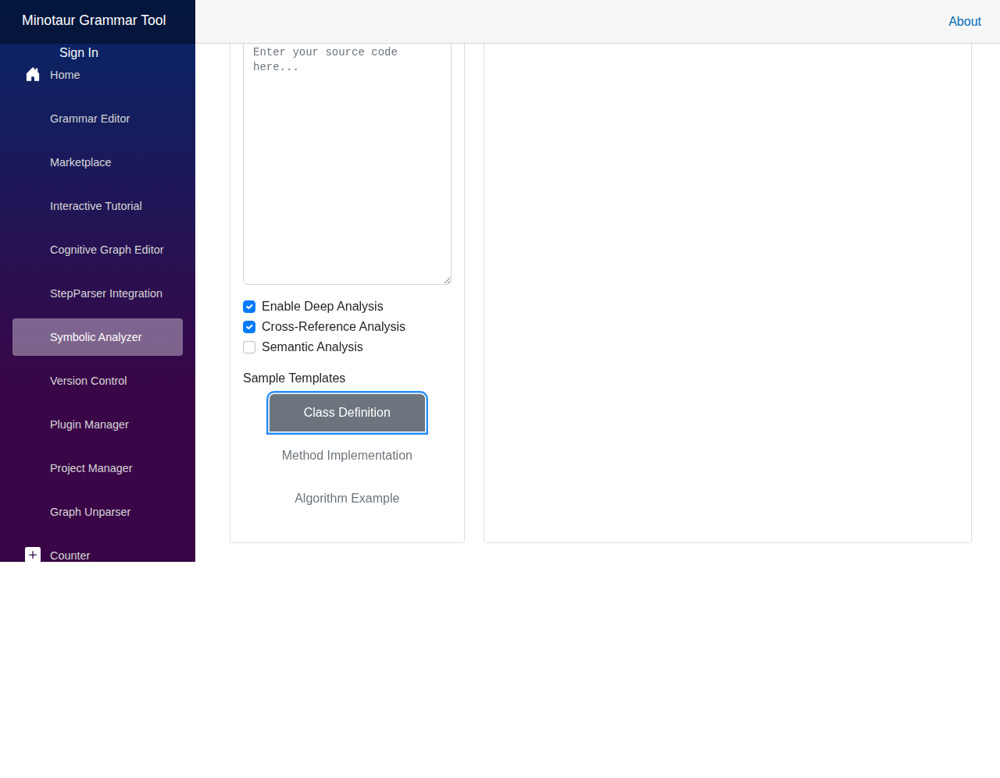
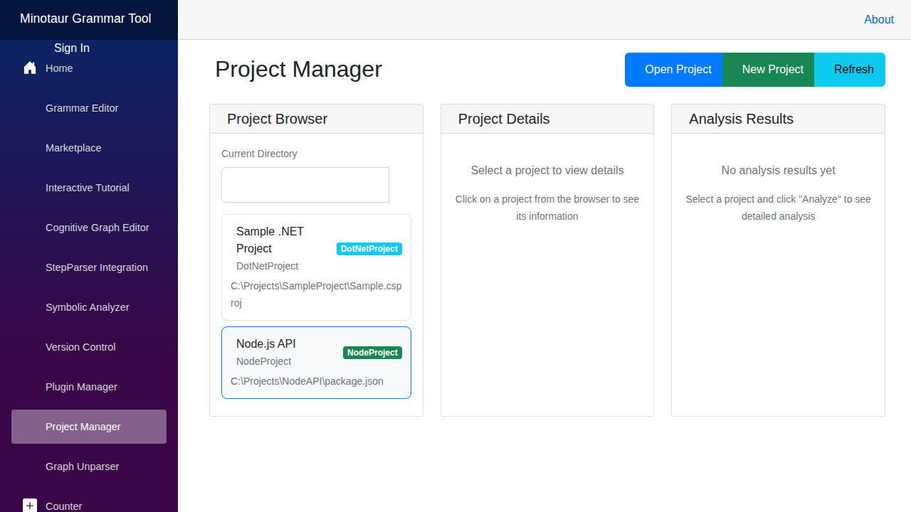

# Minotaur for Code Development - User Guide

This guide shows how to use Minotaur as an IDE for developing and analyzing your application code, where the focus is on your code rather than on grammar development.

**Created:** 2025-10-27 06:00:00 UTC

## Overview

Minotaur serves dual purposes:
1. **Grammar Development** - Creating and refining language grammars
2. **Code Development** - Using Minotaur to parse, analyze, and transform your application code

This guide focuses on **Code Development** workflows where you're working on your application and using Minotaur's powerful parsing and analysis capabilities.

## Use Case: Application Development with Minotaur

### Scenario
You're developing a C#/Java/Python application and want to:
- Parse your entire codebase for analysis
- Understand code structure and dependencies
- Perform symbolic analysis and verification
- Generate documentation or transformations
- Analyze code quality and complexity

The grammar is already established (either built-in or from marketplace), and your focus is on **analyzing and working with your application code**.

---

## Workflow 1: Analyzing Individual Code Files

### Use the Symbolic Analyzer

**Page:** `/symbolic-analyzer`

**Purpose:** Analyze individual source files without worrying about grammar details.

**Steps:**

1. **Select Your Language**
   - Choose C#, Java, Python, JavaScript, or C++
   - Minotaur uses appropriate grammar automatically

2. **Paste Your Code**
   - Copy your application code into the editor
   - Or use sample templates to get started:
     - Class Definition
     - Method Implementation
     - Algorithm Example

3. **Configure Analysis Options**
   - ✅ **Enable Deep Analysis** - Comprehensive code structure analysis
   - ✅ **Cross-Reference Analysis** - Find all references and usages
   - ☐ **Semantic Analysis** - Advanced meaning and intent analysis

4. **Start Analysis**
   - Click "Start Analysis"
   - View results in tabs:
     - **Overview**: Metrics (symbols, complexity, dependencies, quality score)
     - **Symbol Table**: Hierarchical view of all code symbols
     - **Dependencies**: Visual dependency graph
     - **Cognitive Graph**: AST visualization of code structure

5. **Export Results**
   - Export analysis for reports or further processing

**Screenshot:**

**When to Use:**
- Quick analysis of a single file or module
- Understanding specific code sections
- Before refactoring
- Code review preparation
- Learning unfamiliar code

---

## Workflow 2: Full Project Analysis

### Use the Project Manager

**Page:** `/project-manager`

**Purpose:** Load and analyze entire codebases at once.

**Steps:**

1. **Browse Projects**
   - Navigate to your project directory
   - View all detected projects (.csproj, package.json, etc.)

2. **Select a Project**
   - Click on a project to load it
   - View project details:
     - Project type
     - File count
     - Total lines of code
     - Dependencies

3. **Run Project-Wide Analysis**
   - Click "Analyze" to parse the entire project
   - View comprehensive metrics:
     - Complexity heatmaps
     - Dependency graphs
     - Code quality scores
     - Architecture visualization

4. **Navigate Code Structure**
   - Browse files in project
   - Jump to symbols
   - View call hierarchies

**Screenshot:**

**When to Use:**
- Onboarding to a new codebase
- Architectural reviews
- Refactoring planning
- Technical debt assessment
- Documentation generation

---

## Workflow 3: StepParser Integration for Deep Code Understanding

### Use StepParser Integration

**Page:** `/step-parser`

**Purpose:** Step through parsing process to understand how code is interpreted.

**Steps:**

1. **Enter Your Application Code**
   - Paste the code you want to understand
   - The grammar is automatically selected based on language

2. **Parse the Code**
   - Click "Parse" to generate cognitive graph
   - View parsing steps one by one

3. **Explore the Cognitive Graph**
   - See how your code is represented internally
   - Understand AST structure
   - Identify parsing issues or ambiguities

4. **Use for Code Transformation**
   - Understand code structure before transformations
   - Validate transformation logic
   - Generate boilerplate or patterns

**When to Use:**
- Understanding complex code structures
- Debugging parsing issues
- Code generation/transformation projects
- Learning language syntax deeply

---

## Workflow 4: Version Control Integration

### Use Version Control

**Page:** `/version-control`

**Purpose:** Track changes to your analyzed code over time.

**Steps:**

1. **Initialize Repository**
   - Connect to your Git repository
   - Track analysis history

2. **View Changes**
   - See what code changed since last analysis
   - Compare complexity metrics
   - Track quality trends

3. **Commit Analysis Results**
   - Save analysis snapshots
   - Document architectural decisions
   - Track refactoring progress

**When to Use:**
- Long-term code quality tracking
- Before/after refactoring comparisons
- Team collaboration on analysis
- Compliance documentation

---

## Key Differences: Code Development vs. Grammar Development

| Aspect | Grammar Development | Code Development |
|--------|-------------------|------------------|
| **Primary Focus** | Creating/refining grammar rules | Analyzing/transforming application code |
| **Main Tools** | Grammar Editor, Marketplace | Symbolic Analyzer, Project Manager |
| **Input** | Grammar definitions (ANTLR/EBNF) | Application source code (C#, Java, Python, etc.) |
| **Output** | Validated grammar files | Analysis reports, cognitive graphs, metrics |
| **Iteration** | Test grammar against code samples | Analyze code for insights |
| **Goal** | Perfect language recognition | Understand and improve codebase |

---

## Code Development Best Practices

### 1. Start with Project-Level Analysis
- Use **Project Manager** to get the big picture
- Understand overall architecture
- Identify hot spots and problem areas

### 2. Drill Down with Symbolic Analyzer
- Analyze specific files or modules in detail
- Use **Symbolic Analyzer** for focused investigation
- Export results for documentation

### 3. Enable Cross-Reference Analysis
- Always enable for understanding code dependencies
- Critical for refactoring safety
- Helps identify dead code

### 4. Use Built-in Grammars
- Start with marketplace grammars for your language
- No need to create grammars unless working with DSL
- Focus on code, not grammar rules

### 5. Export and Share
- Export analysis results for team review
- Generate reports for stakeholders
- Track metrics over time

---

## Common Code Development Scenarios

### Scenario 1: Onboarding to New Codebase
**Tools:** Project Manager → Symbolic Analyzer  
**Steps:**
1. Load project in Project Manager
2. Review architecture and metrics
3. Identify key modules
4. Deep-dive specific files with Symbolic Analyzer

### Scenario 2: Refactoring Planning
**Tools:** Symbolic Analyzer → Version Control  
**Steps:**
1. Analyze current code quality
2. Enable Cross-Reference Analysis
3. Identify refactoring candidates
4. Track before/after metrics

### Scenario 3: Code Review
**Tools:** Symbolic Analyzer → Export  
**Steps:**
1. Analyze changed files
2. Review complexity scores
3. Check dependencies
4. Export for review documentation

### Scenario 4: Legacy Code Understanding
**Tools:** Project Manager → StepParser → Symbolic Analyzer  
**Steps:**
1. Load entire legacy project
2. Use StepParser to understand parsing
3. Analyze complexity and dependencies
4. Identify modernization opportunities

---

## Tips for Efficient Code Development

### Keyboard Shortcuts
- `Ctrl+O` - Open file/project
- `Ctrl+E` - Export current analysis
- `Ctrl+R` - Refresh analysis
- `F5` - Re-run analysis

### Performance Tips
- For large projects, use file filtering
- Enable incremental analysis mode
- Cache analysis results
- Use project-wide analysis during low-activity periods

### Integration with Other Tools
- Export to your IDE for navigation
- Generate documentation from analysis
- Feed metrics into CI/CD pipelines
- Integrate with code review tools

---

## Next Steps

1. **Try the Interactive Tutorial** (`/tutorial`) - Learn all features
2. **Explore Sample Projects** - Use built-in examples
3. **Check the Marketplace** (`/marketplace`) - Find grammars for your language
4. **Read the Grammar Editor Guide** - For custom DSL development

---

## Summary

Minotaur as a code development IDE provides:

✅ **Instant Code Analysis** - No grammar development needed  
✅ **Multi-Language Support** - C#, Java, Python, JavaScript, C++  
✅ **Project-Wide Insights** - Analyze entire codebases  
✅ **Rich Visualizations** - Dependencies, graphs, metrics  
✅ **Export & Integration** - Share results with your team  

**The key difference**: You focus on understanding and improving your application code, while Minotaur handles all the parsing complexity using established grammars.

---

*For grammar development workflows, see [UI_FLOW.md](UI_FLOW.md)*
