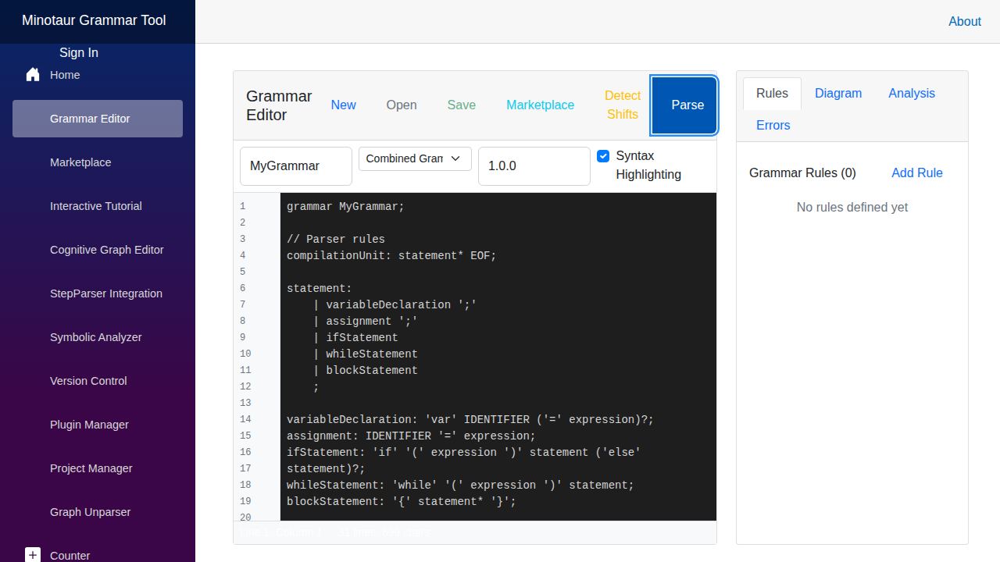

# Implementation Status - Visualization Features

**Last Updated:** 2025-10-27 06:59:00 UTC

This document tracks the implementation progress of the three-phase visualization roadmap for Minotaur.

## Phase 1: Grammar Visualization (Q1)

### Railroad Diagrams
**Status:** 🟡 In Progress (40% Complete)  
**Target:** Q1 2025  
**Priority:** High

**Features:**
- [x] Basic SVG railroad diagram generation
- [x] Integration into Grammar Editor UI (new "Diagram" tab)
- [x] RailroadDiagram.razor component created
- [ ] ANTLR/EBNF grammar parser (using simple parser for now)
- [ ] Click-to-navigate between related rules
- [ ] Real-time diagram updates on grammar edit
- [x] Export button UI (backend not yet implemented)

**Completed:**
- ✅ Created `Components/Shared/RailroadDiagram.razor` component
- ✅ Added "Diagram" tab to Grammar Editor
- ✅ Basic SVG generation for terminals and non-terminals
- ✅ Visual distinction between terminals (blue) and non-terminals (orange)
- ✅ Export button placeholders (SVG/PNG)

**Implementation Plan:**
1. ✅ Create RailroadDiagram.razor component
2. ✅ Add diagram panel to Grammar Editor
3. ⏳ Enhance grammar parser (ANTLR or improved custom parser)
4. ⏳ Implement click-to-navigate between rules
5. ⏳ Implement export functionality (SVG/PNG download)
6. ⏳ Add real-time diagram updates

**Dependencies:**
- Grammar parsing library (basic implementation done, can be enhanced)
- SVG generation library (native C# implementation working)
- UI component integration (✅ completed)

**Screenshot:**

---

### Syntax Tree Visualization
**Status:** 🔴 Not Started  
**Target:** Q1 2025  
**Priority:** Medium

**Features:**
- [ ] Parse tree rendering component
- [ ] Collapsible/expandable tree nodes
- [ ] Highlight matching rules when selecting nodes
- [ ] Export to GraphML format
- [ ] Interactive tree navigation

**Implementation Plan:**
1. Create ParseTreeVisualization.razor component
2. Integrate with StepParser for parse tree data
3. Add tree visualization library (e.g., D3.js via JS interop)
4. Implement node selection and highlighting
5. Add GraphML export functionality

**Dependencies:**
- Tree visualization library
- StepParser integration
- Export functionality

---

## Phase 2: Full Project Analysis (Q2)

### Bulk Project Loading
**Status:** 🟡 Partial (UI Framework Only)  
**Target:** Q2 2025  
**Priority:** High

**Features:**
- [ ] Multi-threaded project file parsing
- [ ] Progress indicators for large codebases
- [ ] File filtering and exclusion patterns
- [ ] Incremental parsing on file changes
- [ ] Project-wide analysis orchestration

**Current Implementation:**
- ✅ Project Manager UI exists at `/project-manager`
- ✅ Project browser with sample projects
- ⚠️ Currently displays mockup data only
- ❌ No actual project loading backend

**Implementation Plan:**
1. Create ProjectLoader service for multi-threaded parsing
2. Implement file system watchers for incremental updates
3. Add progress reporting infrastructure
4. Integrate with existing Project Manager UI
5. Add filtering and exclusion configuration

**Dependencies:**
- File system access
- Multi-threading infrastructure
- Progress reporting system

---

### Project-wide Metrics Dashboard
**Status:** 🟡 Partial (UI Framework Only)  
**Target:** Q2 2025  
**Priority:** Medium

**Features:**
- [ ] Code coverage by grammar rules
- [ ] Complexity heatmaps
- [ ] Dependency visualization with interactive graphs
- [ ] Quality trends over time
- [ ] Architecture visualization

**Current Implementation:**
- ✅ Analysis Results panel in Project Manager
- ⚠️ Currently shows placeholder text
- ❌ No actual metrics calculation

**Implementation Plan:**
1. Create metrics calculation engine
2. Implement complexity analysis algorithms
3. Add data visualization components (charts, heatmaps)
4. Integrate with Project Manager UI
5. Add historical tracking and trend analysis

**Dependencies:**
- Metrics calculation library
- Chart/visualization library
- Data persistence for historical trends

---

## Phase 3: Advanced IDE Features (Q3)

### Interactive Cognitive Graph Editor
**Status:** 🔴 Not Started  
**Target:** Q3 2025  
**Priority:** Medium

**Features:**
- [ ] Visual graph manipulation interface
- [ ] Drag-and-drop node editing
- [ ] Real-time code generation from graph changes
- [ ] Undo/redo support
- [ ] Multi-user collaboration

**Implementation Plan:**
1. Design graph data model
2. Create interactive graph editor component
3. Implement drag-and-drop functionality
4. Add code generation from graph
5. Implement undo/redo stack
6. Add collaboration via SignalR

**Dependencies:**
- Graph visualization library
- SignalR for collaboration
- Code generation engine

---

### Enhanced StepParser Visualization
**Status:** 🟡 Partial (Basic UI Only)  
**Target:** Q3 2025  
**Priority:** Low

**Features:**
- [ ] Animated parsing process
- [ ] Token highlighting during parsing
- [ ] Error recovery visualization
- [ ] Performance profiling overlay

**Current Implementation:**
- ✅ StepParser Integration page exists at `/step-parser`
- ✅ Basic step-by-step interface
- ⚠️ Static visualization only
- ❌ No animation or real-time highlighting

**Implementation Plan:**
1. Add animation framework
2. Implement token-by-token highlighting
3. Add error recovery visualization
4. Integrate performance profiler
5. Add playback controls (play, pause, speed)

**Dependencies:**
- Animation library
- Performance profiling tools
- Enhanced StepParser API

---

## Overall Progress

### Legend
- 🟢 **Complete** - Feature fully implemented and tested
- 🟡 **Partial/In Progress** - UI framework exists or implementation started
- 🔴 **Not Started** - No implementation yet
- ⚠️ **Mockup Data** - UI shows sample/demo data

### Summary by Phase

| Phase | Status | Progress | Target | Notes |
|-------|--------|----------|--------|-------|
| Phase 1 | 🟡 In Progress | 20% | Q1 2025 | Railroad diagrams started |
| Phase 2 | 🟡 Partial | 20% | Q2 2025 | UI framework only |
| Phase 3 | 🔴 Not Started | 5% | Q3 2025 | Basic UI only |

### Current State

**What's Implemented:**
- ✅ UI framework for all major pages
- ✅ Navigation and routing
- ✅ Basic component structure
- ✅ Sample/mockup data for demonstration
- ✅ **NEW**: Railroad diagram component with basic SVG generation
- ✅ **NEW**: "Diagram" tab in Grammar Editor

**What's Missing:**
- ⏳ Advanced railroad diagram generation (basic version working)
- ❌ Syntax tree visualization
- ❌ Actual project loading/parsing backend
- ❌ Metrics calculation engine
- ❌ Interactive graph editing
- ❌ Animation and real-time visualization

---

## Next Steps

### Immediate Priorities (Next Sprint)

1. **Phase 1 - Railroad Diagrams** (Week 1-2) - ✅ Started
   - ✅ Create RailroadDiagram component
   - ✅ Integrate into Grammar Editor
   - ⏳ Enhance grammar parser (improve current simple parser)
   - ⏳ Implement click-to-navigate between rules
   - ⏳ Implement export functionality (SVG/PNG download)

2. **Phase 1 - Syntax Tree Visualization** (Week 3-4)
   - Create ParseTreeVisualization component
   - Integrate with StepParser
   - Add basic tree navigation

3. **Phase 2 - Project Loading** (Week 5-6)
   - Implement ProjectLoader service
   - Add progress reporting
   - Connect to Project Manager UI

### Technical Debt
- Add comprehensive unit tests for all components
- Performance optimization for large grammars/projects
- Accessibility improvements (ARIA labels, keyboard navigation)
- Mobile responsiveness

---

## Dependencies and Libraries

### Needed Libraries

**For Railroad Diagrams:**
- Option 1: [railroad-diagrams](https://github.com/tabatkins/railroad-diagrams) (JavaScript/SVG)
- Option 2: Port to C#/Blazor or use JS interop
- ANTLR parser for grammar analysis

**For Syntax Tree Visualization:**
- D3.js (via JS interop) for tree rendering
- Or Blazor-native tree component library

**For Project Loading:**
- Roslyn for C# parsing
- ANTLR for other languages
- Multi-threading libraries (Task Parallel Library)

**For Metrics Dashboard:**
- Chart libraries (e.g., Blazor.Charts, ApexCharts)
- Heatmap visualization components

---

## Testing Strategy

### Phase 1 Testing
- Unit tests for grammar parser
- Visual regression tests for diagrams
- Integration tests for Grammar Editor

### Phase 2 Testing
- Performance tests for large project loading
- Stress tests for multi-threading
- Accuracy tests for metrics calculation

### Phase 3 Testing
- UI interaction tests for graph editor
- Collaboration tests with multiple users
- Animation performance tests

---

## Contributors

See [CONTRIBUTING.md](../../CONTRIBUTING.md) for how to contribute to these features.

**Areas Needing Help:**
- Railroad diagram library integration
- Grammar parsing expertise
- Performance optimization
- UI/UX design for visualizations

---

*This document is updated as implementation progresses. Last update: 2025-10-27*
