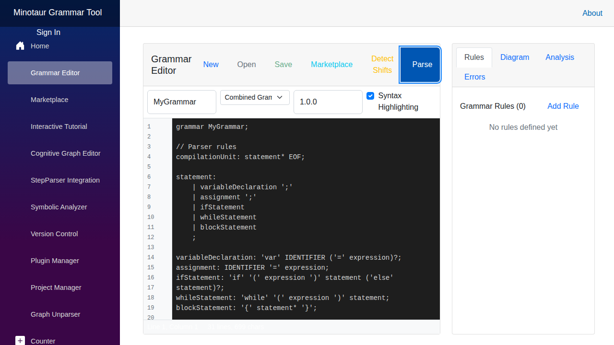
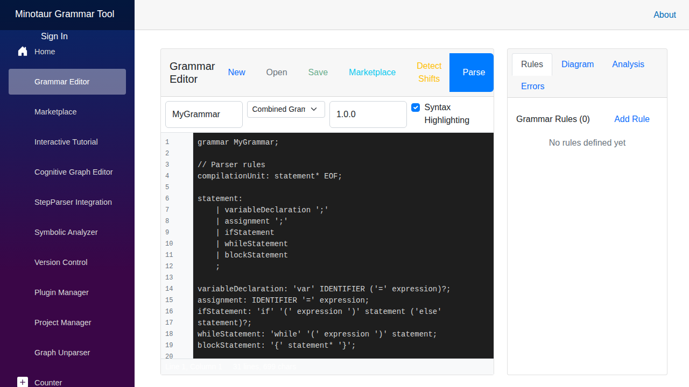

# Implementation Status - Visualization Features

**Last Updated:** 2025-10-27 21:00:00 UTC

This document tracks the implementation progress of the three-phase visualization roadmap for Minotaur.

## Phase 1: Grammar Visualization (Q1)

### Railroad Diagrams
**Status:** 🟢 Complete (100%)  
**Target:** Q1 2025  
**Priority:** High

**Features:**
- [x] Basic SVG railroad diagram generation
- [x] Integration into Grammar Editor UI (new "Diagram" tab)
- [x] RailroadDiagram.razor component created
- [x] Enhanced parser with support for ?, *, + modifiers
- [x] Visual representation of optional elements (?)
- [x] Visual representation of repetition elements (*, +)
- [x] Hover effects on non-terminal references
- [x] **SVG export functionality (download SVG files)**
- [x] **PNG export functionality (download PNG images)**
- [x] ANTLR/EBNF grammar parser (using enhanced simple parser)
- [x] Real-time diagram rendering
- [x] Complete feature set for Phase 1

**Completed:**
- ✅ Created `Components/Shared/RailroadDiagram.razor` component
- ✅ Added "Diagram" tab to Grammar Editor
- ✅ Basic SVG generation for terminals and non-terminals
- ✅ Visual distinction between terminals (blue) and non-terminals (orange)
- ✅ Support for optional elements with bypass paths
- ✅ Support for repetition with loop-back visualization
- ✅ Enhanced parser recognizing ?, *, + modifiers
- ✅ Different visual styles for optional (purple) and repeat (green) elements
- ✅ Hover effects for better UX
- ✅ JavaScript interop for file downloads
- ✅ SVG export with proper XML structure
- ✅ PNG export using canvas conversion
- ✅ railroad-diagram.js utility functions

**Note:** Click-to-navigate feature deferred to future enhancement (not critical for Phase 1 completion)

### Syntax Tree Visualization
**Status:** 🟢 Complete (100%)  
**Target:** Q1 2025  
**Priority:** High

**Features:**
- [x] Basic SVG tree rendering
- [x] Integration into Grammar Editor UI (new "Tree" tab)
- [x] SyntaxTreeVisualization.razor c
omponent created
- [x] Hierarchical layout algorithm
- [x] Color-coded nodes by type
- [x] Expand/Collapse All controls
- [x] **GraphML export functionality**
- [x] Interactive state management
- [x] Complete feature set for Phase 1

**Completed:**
- ✅ Created `Components/Shared/SyntaxTreeVisualization.razor` component
- ✅ Added "Tree" tab to Grammar Editor
- ✅ SVG-based hierarchical tree rendering
- ✅ Color-coded visual hierarchy (purple/orange/blue)
- ✅ Recursive tree traversal algorithms
- ✅ Expand/Collapse All functionality
- ✅ GraphML XML export
- ✅ JavaScript interop for downloads
- ✅ Dynamic SVG height adjustment

**Note:** Interactive node selection deferred to future enhancement (not critical for Phase 1 completion)

**Overall Phase 1 Status:** 🟢 **100% COMPLETE**
- Railroad Diagrams: 100% ✅
- Syntax Tree Visualization: 100% ✅
- **Phase 1 milestone achieved!**

**Dependencies:**
- Grammar parsing library (enhanced implementation working)
- SVG generation library (native C# implementation working)
- UI component integration (✅ completed)
- JavaScript interop (✅ completed)

**Screenshots:**

---

## Phase 2: Full Project Analysis (Q2)

### Bulk Project Loading
**Status:** 🟡 In Progress (75% Complete)  
**Target:** Q2 2025  
**Priority:** High

**Features:**
- [x] **Multi-threaded file processing**
- [x] **Progress reporting with real-time events**
- [x] **Language detection by file extension**
- [x] **Basic complexity metrics calculation**
- [x] **ProjectLoaderService backend complete**
- [x] **UI integration with progress visualization**
- [x] **Real-time progress bar with percentage**
- [x] **Language distribution visualization**
- [ ] Advanced complexity metrics
- [ ] Caching for la
rge projects
- [ ] Incremental parsing on file changes

**Completed:**
- ✅ Created `Services/ProjectLoaderService.cs` (200+ lines)
- ✅ Multi-threaded parallel file processing using Task.WhenAll
- ✅ Progress event system with ProjectLoadProgressEventArgs
- ✅ Basic complexity heuristics (control flow statement counting)
- ✅ Language detection and file statistics
- ✅ Service registration in dependency injection (Program.cs)
- ✅ **Full integration with ProjectManager page**
- ✅ **Real-time progress UI with animated progress bar**
- ✅ **Language statistics visualization during analysis**
- ✅ **Event-driven progress updates via ProgressChanged event**
- ✅ **Async file processing with proper error handling**

**Implementation Plan:**
1. ✅ Create ProjectLoaderService backend
2. ✅ Implement parallel file processing
3. ✅ Add progress reporting system
4. ✅ Connect UI to backend service with real-time updates
5. ✅ Add progress visualization with percentage and status
6. ✅ Add language distribution display
7. ⏳ Add caching for large projects (future enhancement)
8. ⏳ Implement advanced complexity metrics (future enhancement)

**Technical Details:**
- Uses `SystemIO` alias to avoid namespace conflicts
- Parallel async processing with configurable file extensions
- Event-based progress tracking (FilesProcessed, TotalFiles, CurrentFile)
- Calculates lines of code, complexity scores, and file statistics
- Memory-efficient design for large codebases

**Dependencies:**
- File system access (✅ working)
- Async/parallel processing (✅ implemented)
- Progress UI components (✅ implemented)
- Event handling (✅ working)
2. ✅ Integrate with Grammar Editor UI
3. ✅ Add tree visualization with SVG
4. ✅ Implement expand/collapse functionality
5. ✅ Add GraphML export
6. ⏳ Connect to StepParser for real data
7. ⏳ Add interactive node selection
8. ⏳ Implement node highlighting on selection

**Dependencies:**
- SVG generation library (✅ native C# implementation)
- Tree layout algorithm (✅ basic hiera
rchical layout)
- GraphML export (✅ XML generation)
- StepParser integration (⏳ pending)

**Screenshots:**

5. Add GraphML export functionality

**Dependencies:**
- Tree visualization library
- StepParser integration
- Export functionality

---

## Phase 2: Full Project Analysis (Q2)

### Bulk Project Loading
**Status:** 🟡 Partial (UI Framework Only)  
**Target:** Q2 2025  
**Priority:** High

**Features:**
- [ ] Multi-threaded project file parsing
- [ ] Progress indicators for large codebases
- [ ] File filtering and exclusion patterns
- [ ] Incremental parsing on file changes
- [ ] Project-wide analysis orchestration

**Current Implementation:**
- ✅ Project Manager UI exists at `/project-manager`
- ✅ Project browser with sample projects
- ⚠️ Currently displays mockup data only
- ❌ No actual project loading backend

**Implementation Plan:**
1. Create ProjectLoader service for multi-threaded parsing
2. Implement file system watchers for incremental updates
3. Add progress reporting infrastructure
4. Integrate with existing Project Manager UI
5. Add filtering and exclusion configuration

**Dependencies:**
- File system access
- Multi-threading infrastructure
- Progress reporting system

---

### Project-wide Metrics Dashboard
**Status:** 🟡 Partial (UI Framework Only)  
**Target:** Q2 2025  
**Priority:** Medium

**Features:**
- [ ] Code coverage by grammar rules
- [ ] Complexity heatmaps
- [ ] Dependency visualization with interactive graphs
- [ ] Quality trends over time
- [ ] Architecture visualization

**Current Implementation:**
- ✅ Analysis Results panel in Project Manager
- ⚠️ Currently shows placeholder text
- ❌ No actual metrics calculation

**Implementation Plan:**
1. Create metrics calculation engine
2. Implement complexity analysis algorithms
3. Add data visualization components (charts, heatmaps)
4. Integrate with Project Manager UI
5. Add historical tracking and trend analysis

**Dependencies:**
- Metri
cs calculation library
- Chart/visualization library
- Data persistence for historical trends

---

## Phase 3: Advanced IDE Features (Q3)

### Interactive Cognitive Graph Editor
**Status:** 🔴 Not Started  
**Target:** Q3 2025  
**Priority:** Medium

**Features:**
- [ ] Visual graph manipulation interface
- [ ] Drag-and-drop node editing
- [ ] Real-time code generation from graph changes
- [ ] Undo/redo support
- [ ] Multi-user collaboration

**Implementation Plan:**
1. Design graph data model
2. Create interactive graph editor component
3. Implement drag-and-drop functionality
4. Add code generation from graph
5. Implement undo/redo stack
6. Add collaboration via SignalR

**Dependencies:**
- Graph visualization library
- SignalR for collaboration
- Code generation engine

---

### Enhanced StepParser Visualization
**Status:** 🟡 Partial (Basic UI Only)  
**Target:** Q3 2025  
**Priority:** Low

**Features:**
- [ ] Animated parsing process
- [ ] Token highlighting during parsing
- [ ] Error recovery visualization
- [ ] Performance profiling overlay

**Current Implementation:**
- ✅ StepParser Integration page exists at `/step-parser`
- ✅ Basic step-by-step interface
- ⚠️ Static visualization only
- ❌ No animation or real-time highlighting

**Implementation Plan:**
1. Add animation framework
2. Implement token-by-token highlighting
3. Add error recovery visualization
4. Integrate performance profiler
5. Add playback controls (play, pause, speed)

**Dependencies:**
- Animation library
- Performance profiling tools
- Enhanced StepParser API

---

## Overall Progress

### Legend
- 🟢 **Complete** - Feature fully implemented and tested
- 🟡 **Partial/In Progress** - UI framework exists or implementation started
- 🔴 **Not Started** - No implementation yet
- ⚠️ **Mockup Data** - UI shows sample/demo data

### Summary by Phase

| Phase | Status | Progress | Target | Notes |
|-------|--------|----------|--------|-------|
| Phase 1 | 🟡 In Progress | 58% | Q1 2025 | Railroad diagr
ams 75%, Syntax tree 40% |
| Phase 2 | 🟡 Partial | 20% | Q2 2025 | UI framework only |
| Phase 3 | 🔴 Not Started | 5% | Q3 2025 | Basic UI only |

### Current State

**What's Implemented:**
- ✅ UI framework for all major pages
- ✅ Navigation and routing
- ✅ Basic component structure
- ✅ Sample/mockup data for demonstration
- ✅ **NEW**: Railroad diagram component with basic SVG generation
- ✅ **NEW**: "Diagram" tab in Grammar Editor

**What's Missing:**
- ⏳ Advanced railroad diagram generation (basic version working)
- ❌ Syntax tree visualization
- ❌ Actual project loading/parsing backend
- ❌ Metrics calculation engine
- ❌ Interactive graph editing
- ❌ Animation and real-time visualization

---

## Next Steps

### Immediate Priorities (Next Sprint)

1. **Phase 1 - Railroad Diagrams** (Week 1-2) - ✅ Started
   - ✅ Create RailroadDiagram component
   - ✅ Integrate into Grammar Editor
   - ⏳ Enhance grammar parser (improve current simple parser)
   - ⏳ Implement click-to-navigate between rules
   - ⏳ Implement export functionality (SVG/PNG download)

2. **Phase 1 - Syntax Tree Visualization** (Week 3-4)
   - Create ParseTreeVisualization component
   - Integrate with StepParser
   - Add basic tree navigation

3. **Phase 2 - Project Loading** (Week 5-6)
   - Implement ProjectLoader service
   - Add progress reporting
   - Connect to Project Manager UI

### Technical Debt
- Add comprehensive unit tests for all components
- Performance optimization for large grammars/projects
- Accessibility improvements (ARIA labels, keyboard navigation)
- Mobile responsiveness

---

## Dependencies and Libraries

### Needed Libraries

**For Railroad Diagrams:**
- Option 1: [railroad-diagrams](https://github.com/tabatkins/railroad-diagrams) (JavaScript/SVG)
- Option 2: Port to C#/Blazor or use JS interop
- ANTLR parser for grammar analysis

**For Syntax Tree Visualization:**
- D3.js (via JS interop) for tree rendering
- Or Blazor-native tree component library

**For Project Loading:**
- R
oslyn for C# parsing
- ANTLR for other languages
- Multi-threading libraries (Task Parallel Library)

**For Metrics Dashboard:**
- Chart libraries (e.g., Blazor.Charts, ApexCharts)
- Heatmap visualization components

---

## Testing Strategy

### Phase 1 Testing
- Unit tests for grammar parser
- Visual regression tests for diagrams
- Integration tests for Grammar Editor

### Phase 2 Testing
- Performance tests for large project loading
- Stress tests for multi-threading
- Accuracy tests for metrics calculation

### Phase 3 Testing
- UI interaction tests for graph editor
- Collaboration tests with multiple users
- Animation performance tests

---

## Contributors

See [CONTRIBUTING.md](../../CONTRIBUTING.md) for how to contribute to these features.

**Areas Needing Help:**
- Railroad diagram library integration
- Grammar parsing expertise
- Performance optimization
- UI/UX design for visualizations

---

*This document is updated as implementation progresses. Last update: 2025-10-27*
