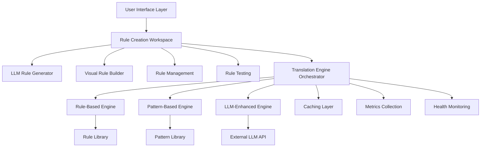

# Technical Specifications and API Documentation

## Table of Contents
1. [System Architecture](#system-architecture)
2. [Core Interfaces](#core-interfaces)
3. [Engine Specifications](#engine-specifications)
4. [API Reference](#api-reference)
5. [Data Models](#data-models)
6. [Configuration Schema](#configuration-schema)
7. [Performance Specifications](#performance-specifications)
8. [Security Specifications](#security-specifications)
9. [Integration Specifications](#integration-specifications)
10. [Testing Specifications](#testing-specifications)

## System Architecture

### High-Level Architecture



### Component Dependencies

```typescript
interface SystemDependencies {
  // Core Dependencies
  react: "^18.0.0";
  typescript: "^4.9.0";
  
  // UI Dependencies
  "@types/react": "^18.0.0";
  "@types/react-dom": "^18.0.0";
  
  // Testing Dependencies
  jest: "^29.0.0";
  "@testing-library/react": "^13.0.0";
  "@testing-library/jest-dom": "^5.16.0";
  
  // Build Dependencies
  "@babel/core": "^7.20.0";
  "@babel/preset-env": "^7.20.0";
  "@babel/preset-react": "^7.18.0";
  "@babel/preset-typescript": "^7.18.0";
}
```

### Module Structure

```
src/
├── interactive/                    # Interactive AST Translation System
│   ├── engines/                   # Translation Engines
│   │   ├── TranslationEngineInterface.ts
│   │   ├── RuleBasedTranslationEngine.ts
│   │   ├── PatternBasedTranslationEngine.ts
│   │   ├── LLMTranslationEngine.ts
│   │   └── TranslationEngineOrchestrator.ts
│   ├── components/                # UI Components
│   │   ├── LLMRuleGeneratorPanel.tsx
│   │   ├── RuleManagementDashboard.tsx
│   │   ├── VisualRuleBuilder.tsx
│   │   ├── RuleTestingInterface.tsx
│   │   └── RuleCreationWorkspace.tsx
│   ├── __tests__/                 # Test Files
│   │   ├── SimpleIntegrationTest.test.ts
│   │   └── RuleCreationIntegration.test.ts
│   ├── InteractiveASTTranslator.ts
│   └── PatternRecognitionEngine.ts
├── zerocopy/                      # Zero-Copy AST Infrastructure
├── memory/                        # Memory Management
├── optimization/                  # Performance Optimization
├── validation/                    # Validation Systems
├── translation/                   # Translation Systems
└── compiler/                      # Code Generation
```

## Core Interfaces

### TranslationEngine Interface

```typescript
/**
 * Core interface that all translation engines must implement
 */
export interface TranslationEngine {
  /** Unique engine identifier */
  readonly name: string;
  
  /** Engine priority (higher = preferred) */
  readonly priority: number;
  
  /** Engine version */
  readonly version: string;
  
  /** Engine capabilities */
  readonly capabilities: EngineCapabilities;
  
  /**
   * Translate code from source to target language
   */
  translate(
    code: string,
    sourceLanguage: string,
    targetLanguage: string,
    options?: TranslationOptions
  ): Promise<TranslationResult>;
  
  /**
   * Check if engine is available and healthy
   */
  isAvailable(): Promise<boolean>;
  
  /**
   * Get current engine health status
   */
  getHealthStatus(): Promise<EngineHealthStatus>;
  
  /**
   * Initialize engine with configuration
   */
  initialize?(config: EngineConfig): Promise<void>;
  
  /**
   * Cleanup engine resources
   */
  dispose?(): Promise<void>;
}
```

### EngineCapabilities Interface

```typescript
export interface EngineCapabilities {
  /** Supported source languages */
  sourceLanguages: string[];
  
  /** Supported target languages */
  targetLanguages: string[];
  
  /** Maximum code complexity this engine can handle */
  maxComplexity: number;
  
  /** Whether engine supports batch processing */
  supportsBatch: boolean;
  
  /** Whether engine requires network connectivity */
  requiresNetwork: boolean;
  
  /** Whether engine supports custom pattern creation */
  supportsCustomPatterns: boolean;
  
  /** Whether engine can provide explanations */
  supportsExplanations: boolean;
  
  /** Whether engine can provide alternative translations */
  supportsAlternatives: boolean;
  
  /** Memory requirement in MB */
  memoryRequirement: number;
  
  /** CPU intensity (0-1 scale) */
  cpuIntensity: number;
}
```

### TranslationResult Interface

```typescript
export interface TranslationResult {
  /** Whether translation was successful */
  success: boolean;
  
  /** Transformed code (if successful) */
  transformedCode?: string;
  
  /** Confidence score (0-1) */
  confidence: number;
  
  /** Execution time in milliseconds */
  executionTime: number;
  
  /** Engine that performed the translation */
  engineUsed: string;
  
  /** Cost of translation (if applicable) */
  cost?: number;
  
  /** Memory used in MB */
  memoryUsed?: number;
  
  /** Error information (if failed) */
  error?: TranslationError;
  
  /** Additional metadata */
  metadata?: TranslationMetadata;
  
  /** Quality metrics */
  quality?: QualityMetrics;
  
  /** Performance metrics */
  performance?: PerformanceMetrics;
  
  /** Warnings (non-fatal issues) */
  warnings?: TranslationWarning[];
  
  /** Suggested improvements */
  improvements?: TranslationImprovement[];
}
```

### TransformationRule Interface

```typescript
export interface TransformationRule {
  /** Unique rule identifier */
  id: string;
  
  /** Human-readable rule name */
  name: string;
  
  /** Rule description */
  description: string;
  
  /** Source language */
  sourceLanguage: string;
  
  /** Target language */
  targetLanguage: string;
  
  /** Pattern matching configuration */
  pattern: RulePattern;
  
  /** Transformation configuration */
  transformation: RuleTransformation;
  
  /** Validation constraints */
  constraints: RuleConstraint[];
  
  /** Rule confidence score */
  confidence: number;
  
  /** Example transformations */
  examples: TransformationExample[];
  
  /** Rule tags for organization */
  tags: string[];
  
  /** Rule creator */
  createdBy: 'user' | 'ai' | 'system';
  
  /** Creation timestamp */
  createdAt: Date;
  
  /** Last modification timestamp */
  lastModified: Date;
  
  /** Usage statistics */
  usageCount: number;
  
  /** Success rate (0-1) */
  successRate: number;
  
  /** Whether rule is enabled */
  enabled: boolean;
  
  /** Rule version */
  version: string;
  
  /** Rule category */
  category: string;
  
  /** Rule complexity level */
  complexity: 'simple' | 'moderate' | 'complex';
  
  /** Rule quality score */
  quality: number;
}
```

## Engine Specifications

### Rule-Based Translation Engine

**Purpose**: Fast, deterministic transformations using predefined rules

**Technical Specifications**:
```typescript
class RuleBasedTranslationEngine implements TranslationEngine {
  name = 'rule-based';
  priority = 1000;
  version = '1.0.0';
  
  capabilities: EngineCapabilities = {
    sourceLanguages: ['asp', 'vbscript', 'javascript', 'sql'],
    targetLanguages: ['csharp', 'typescript', 'python', 'sql'],
    maxComplexity: 8,
    supportsBatch: true,
    requiresNetwork: false,
    supportsCustomPatterns: true,
    supportsExplanations: false,
    supportsAlternatives: false,
    memoryRequirement: 64,
    cpuIntensity: 0.3
  };
}
```

**Performance Characteristics**:
- **Response Time**: <100ms for simple transformations
- **Memory Usage**: 64MB base + 1MB per 1000 rules
- **Throughput**: 100+ transformations per second
- **Accuracy**: 95%+ for covered patterns

**Rule Storage Format**:
```typescript
interface StoredRule {
  pattern: {
    type: 'regex' | 'ast-pattern' | 'semantic';
    pattern: string;
    variables: Record<string, string>;
    context: string[];
  };
  transformation: {
    type: 'template' | 'function' | 'ast-transform';
    template: string;
    parameters: Record<string, any>;
    postProcessing: string[];
  };
}
```

### Pattern-Based Translation Engine

**Purpose**: Learning-based transformations that improve over time

**Technical Specifications**:
```typescript
class PatternBasedTranslationEngine implements TranslationEngine {
  name = 'pattern-based';
  priority = 800;
  version = '1.0.0';
  
  capabilities: EngineCapabilities = {
    sourceLanguages: ['asp', 'vbscript', 'javascript', 'sql', 'cobol'],
    targetLanguages: ['csharp', 'typescript', 'python', 'sql', 'java'],
    maxComplexity: 6,
    supportsBatch: true,
    requiresNetwork: false,
    supportsCustomPatterns: true,
    supportsExplanations: false,
    supportsAlternatives: true,
    memoryRequirement: 128,
    cpuIntensity: 0.5
  };
}
```

**Learning Algorithm**:
```typescript
interface PatternLearning {
  /** Statistical pattern extraction */
  extractPatterns(examples: TransformationExample[]): Pattern[];
  
  /** User feedback integration */
  incorporateFeedback(
    transformation: TranslationResult,
    feedback: UserFeedback
  ): void;
  
  /** Pattern quality assessment */
  assessPatternQuality(pattern: Pattern): QualityScore;
  
  /** Pattern optimization */
  optimizePatterns(): void;
}
```

**Performance Characteristics**:
- **Response Time**: <500ms for learned patterns
- **Memory Usage**: 128MB base + 2MB per 1000 patterns
- **Learning Rate**: Improves 5-10% per 100 user corrections
- **Accuracy**: 85%+ for learned patterns, improves over time

### LLM-Enhanced Translation Engine

**Purpose**: Complex semantic understanding using language models

**Technical Specifications**:
```typescript
class LLMTranslationEngine implements TranslationEngine {
  name = 'llm-enhanced';
  priority = 600;
  version = '1.0.0';
  
  capabilities: EngineCapabilities = {
    sourceLanguages: ['*'], // Supports all languages
    targetLanguages: ['*'], // Supports all languages
    maxComplexity: 10,
    supportsBatch: false,
    requiresNetwork: true,
    supportsCustomPatterns: true,
    supportsExplanations: true,
    supportsAlternatives: true,
    memoryRequirement: 256,
    cpuIntensity: 0.2
  };
}
```

**API Integration**:
```typescript
interface LLMConfiguration {
  /** API endpoint */
  endpoint: string;
  
  /** Authentication */
  apiKey: string;
  
  /** Model configuration */
  model: {
    name: string;
    temperature: number;
    maxTokens: number;
    topP: number;
  };
  
  /** Cost controls */
  costLimits: {
    maxCostPerRequest: number;
    dailyLimit: number;
    monthlyLimit: number;
  };
  
  /** Timeout settings */
  timeouts: {
    requestTimeout: number;
    retryAttempts: number;
    backoffMultiplier: number;
  };
}
```

**Performance Characteristics**:
- **Response Time**: 1-5 seconds depending on complexity
- **Memory Usage**: 256MB base + variable for context
- **Cost**: $0.001-$0.01 per transformation
- **Accuracy**: 90%+ for complex transformations

### Translation Engine Orchestrator

**Purpose**: Intelligent coordination of multiple translation engines

**Technical Specifications**:
```typescript
class TranslationEngineOrchestrator implements TranslationEngine {
  name = 'orchestrator';
  priority = 1000;
  version = '1.0.0';
  
  /** Engine selection strategies */
  strategies: {
    priority: PriorityStrategy;
    speed: SpeedStrategy;
    cost: CostStrategy;
    quality: QualityStrategy;
    reliability: ReliabilityStrategy;
    bestResult: BestResultStrategy;
  };
  
  /** Health monitoring */
  healthMonitor: EngineHealthMonitor;
  
  /** Performance tracking */
  metricsCollector: MetricsCollector;
  
  /** Configuration management */
  configManager: ConfigurationManager;
}
```

**Selection Algorithm**:
```typescript
interface EngineSelection {
  /** Evaluate engines for request */
  evaluateEngines(
    request: TranslationRequest,
    strategy: SelectionStrategy
  ): EngineCandidate[];
  
  /** Select best engine */
  selectEngine(
    candidates: EngineCandidate[],
    constraints: SelectionConstraints
  ): TranslationEngine;
  
  /** Handle engine failure */
  handleFailure(
    failedEngine: TranslationEngine,
    request: TranslationRequest
  ): TranslationEngine | null;
}
```

## API Reference

### REST API Endpoints

#### Translation API

```typescript
/**
 * Translate code using the orchestrator
 */
POST /api/v1/translate
Content-Type: application/json

Request Body:
{
  "code": string;              // Source code to translate
  "sourceLanguage": string;    // Source language identifier
  "targetLanguage": string;    // Target language identifier
  "strategy"?: string;         // Engine selection strategy
  "options"?: {
    "maxCost"?: number;        // Maximum cost limit
    "maxTime"?: number;        // Maximum time limit (ms)
    "minConfidence"?: number;  // Minimum confidence threshold
    "enginePreference"?: string[]; // Preferred engines
  };
}

Response:
{
  "success": boolean;
  "result"?: TranslationResult;
  "error"?: {
    "code": string;
    "message": string;
    "details"?: any;
  };
}
```

#### Rule Management API

```typescript
/**
 * Get all transformation rules
 */
GET /api/v1/rules
Query Parameters:
  - sourceLanguage?: string
  - targetLanguage?: string
  - category?: string
  - tags?: string[]
  - enabled?: boolean
  - limit?: number
  - offset?: number

Response:
{
  "rules": TransformationRule[];
  "total": number;
  "hasMore": boolean;
}

/**
 * Create new transformation rule
 */
POST /api/v1/rules
Content-Type: application/json

Request Body: TransformationRule

Response:
{
  "success": boolean;
  "rule"?: TransformationRule;
  "error"?: ErrorInfo;
}

/**
 * Update existing rule
 */
PUT /api/v1/rules/{ruleId}
Content-Type: application/json

Request Body: Partial<TransformationRule>

Response:
{
  "success": boolean;
  "rule"?: TransformationRule;
  "error"?: ErrorInfo;
}

/**
 * Delete rule
 */
DELETE /api/v1/rules/{ruleId}

Response:
{
  "success": boolean;
  "error"?: ErrorInfo;
}
```

#### Engine Management API

```typescript
/**
 * Get engine status
 */
GET /api/v1/engines/status

Response:
{
  "engines": {
    [engineName: string]: {
      "available": boolean;
      "healthy": boolean;
      "lastUsed": Date | null;
      "successRate": number;
      "avgResponseTime": number;
      "capabilities": EngineCapabilities;
    };
  };
  "orchestrator": {
    "strategy": string;
    "totalTranslations": number;
    "successRate": number;
    "avgCost": number;
  };
}

/**
 * Update orchestrator configuration
 */
POST /api/v1/engines/config
Content-Type: application/json

Request Body: OrchestratorConfig

Response:
{
  "success": boolean;
  "config"?: OrchestratorConfig;
  "error"?: ErrorInfo;
}
```

#### Testing API

```typescript
/**
 * Test transformation rule
 */
POST /api/v1/test/rule/{ruleId}
Content-Type: application/json

Request Body:
{
  "testCode": string;
  "expectedOutput"?: string;
}

Response:
{
  "success": boolean;
  "result": {
    "transformedCode": string;
    "confidence": number;
    "executionTime": number;
    "passed": boolean;
    "differences"?: string[];
  };
  "error"?: ErrorInfo;
}

/**
 * Batch test multiple rules
 */
POST /api/v1/test/batch
Content-Type: application/json

Request Body:
{
  "ruleIds": string[];
  "testCases": {
    "code": string;
    "expectedOutput"?: string;
  }[];
  "options": {
    "parallel": boolean;
    "stopOnFailure": boolean;
    "timeout": number;
  };
}

Response:
{
  "success": boolean;
  "results": BatchTestResult[];
  "summary": {
    "totalTests": number;
    "passed": number;
    "failed": number;
    "avgExecutionTime": number;
  };
  "error"?: ErrorInfo;
}
```

### WebSocket API

```typescript
/**
 * Real-time engine status updates
 */
WebSocket: /ws/engine-status

Messages:
{
  "type": "engine-status-update";
  "data": {
    "engineName": string;
    "status": EngineHealthStatus;
    "timestamp": Date;
  };
}

{
  "type": "translation-progress";
  "data": {
    "requestId": string;
    "progress": number; // 0-100
    "currentEngine": string;
    "estimatedTimeRemaining": number;
  };
}

{
  "type": "rule-update";
  "data": {
    "action": "created" | "updated" | "deleted";
    "rule": TransformationRule;
    "timestamp": Date;
  };
}
```

## Data Models

### Core Data Types

```typescript
// Language identifiers
type LanguageId = 
  | 'asp' | 'vbscript' | 'javascript' | 'typescript'
  | 'csharp' | 'java' | 'python' | 'go' | 'rust'
  | 'sql' | 'cobol' | 'fortran' | 'pascal';

// Engine selection strategies
type SelectionStrategy = 
  | 'priority' | 'speed' | 'cost' | 'quality' 
  | 'reliability' | 'best-result';

// Rule complexity levels
type ComplexityLevel = 'simple' | 'moderate' | 'complex';

// Rule pattern types
type PatternType = 'regex' | 'ast-pattern' | 'semantic';

// Transformation types
type TransformationType = 'template' | 'function' | 'ast-transform';
```

### Configuration Models

```typescript
export interface OrchestratorConfig {
  /** Engine selection strategy */
  strategy: SelectionStrategy;
  
  /** Engine availability flags */
  enableRuleBased: boolean;
  enablePatternBased: boolean;
  enableLLM: boolean;
  
  /** Cost and time limits */
  maxCost: number;
  maxTime: number;
  minConfidence: number;
  
  /** Fallback behavior */
  fallbackToLowerConfidence: boolean;
  
  /** Health monitoring */
  enableHealthChecks: boolean;
  retryFailedEngines: boolean;
  
  /** Engine-specific configurations */
  engineConfigs?: {
    [engineName: string]: EngineConfig;
  };
}

export interface EngineConfig {
  /** Engine-specific settings */
  settings: Record<string, any>;
  
  /** Resource limits */
  resourceLimits: {
    maxMemory: number;
    maxCpuTime: number;
    maxConcurrency: number;
  };
  
  /** Caching configuration */
  caching: {
    enabled: boolean;
    maxSize: number;
    ttl: number;
  };
  
  /** Retry configuration */
  retry: {
    maxAttempts: number;
    backoffMultiplier: number;
    maxBackoffTime: number;
  };
}
```

### Metrics Models

```typescript
export interface EngineMetrics {
  /** Usage statistics */
  totalTranslations: number;
  successfulTranslations: number;
  failedTranslations: number;
  
  /** Performance metrics */
  averageConfidence: number;
  averageProcessingTime: number;
  averageMemoryUsage: number;
  
  /** Cost tracking */
  totalCost: number;
  
  /** Cache statistics */
  cacheStats: {
    totalRequests: number;
    hits: number;
    misses: number;
    hitRate: number;
    currentSize: number;
    evictions: number;
  };
  
  /** Quality metrics */
  qualityStats: {
    averageQuality: number;
    qualityDistribution: Record<string, number>;
    userSatisfaction: number;
    patternSuccessRate: number;
  };
  
  /** Performance statistics */
  performanceStats: {
    averageSpeed: number;
    peakMemoryUsage: number;
    averageCpuUtilization: number;
  };
  
  /** Error tracking */
  errorStats: {
    errorsByType: Record<string, number>;
    errorsBySeverity: Record<string, number>;
    commonErrors: string[];
    resolutionRate: number;
  };
}
```

## Configuration Schema

### System Configuration

```yaml
# config/system.yaml
system:
  # Application settings
  app:
    name: "Minotaur Transformation System"
    version: "1.0.0"
    environment: "production" # development, staging, production
    
  # Server configuration
  server:
    host: "0.0.0.0"
    port: 3000
    cors:
      enabled: true
      origins: ["*"]
    
  # Database configuration
  database:
    type: "sqlite" # sqlite, postgresql, mysql
    path: "./data/minotaur.db"
    pool:
      min: 1
      max: 10
    
  # Logging configuration
  logging:
    level: "info" # debug, info, warn, error
    format: "json" # json, text
    outputs: ["console", "file"]
    file:
      path: "./logs/minotaur.log"
      maxSize: "100MB"
      maxFiles: 10
```

### Engine Configuration

```yaml
# config/engines.yaml
engines:
  # Rule-based engine
  rule-based:
    enabled: true
    priority: 1000
    settings:
      ruleLibraryPath: "./data/rules"
      cacheSize: 1000
      maxConcurrency: 10
    resources:
      maxMemory: "128MB"
      maxCpuTime: "5s"
    
  # Pattern-based engine
  pattern-based:
    enabled: true
    priority: 800
    settings:
      patternLibraryPath: "./data/patterns"
      learningRate: 0.1
      minPatternConfidence: 0.7
    resources:
      maxMemory: "256MB"
      maxCpuTime: "10s"
    
  # LLM-enhanced engine
  llm-enhanced:
    enabled: false # Disabled by default
    priority: 600
    settings:
      apiEndpoint: "https://api.openai.com/v1"
      model: "gpt-4"
      temperature: 0.1
      maxTokens: 2048
    resources:
      maxMemory: "512MB"
      maxCpuTime: "30s"
    costLimits:
      maxCostPerRequest: 0.10
      dailyLimit: 10.00
      monthlyLimit: 100.00

# Orchestrator configuration
orchestrator:
  defaultStrategy: "priority"
  healthChecks:
    enabled: true
    interval: "30s"
    timeout: "5s"
  metrics:
    enabled: true
    retentionPeriod: "30d"
  caching:
    enabled: true
    maxSize: 10000
    ttl: "1h"
```

### UI Configuration

```yaml
# config/ui.yaml
ui:
  # Theme configuration
  theme:
    primary: "#2563eb"
    secondary: "#64748b"
    accent: "#f59e0b"
    background: "#ffffff"
    surface: "#f8fafc"
    
  # Feature flags
  features:
    llmGeneration: true
    visualBuilder: true
    batchTesting: true
    analytics: true
    
  # Default settings
  defaults:
    pageSize: 20
    autoSave: true
    showDebugInfo: false
    enableNotifications: true
    
  # Performance settings
  performance:
    virtualScrolling: true
    lazyLoading: true
    debounceTime: 300
    maxFileSize: "10MB"
```

## Performance Specifications

### Response Time Requirements

```typescript
interface PerformanceTargets {
  /** API response times (95th percentile) */
  api: {
    translate: 2000; // 2 seconds
    getRules: 500;   // 500ms
    createRule: 1000; // 1 second
    testRule: 3000;   // 3 seconds
  };
  
  /** UI interaction times */
  ui: {
    pageLoad: 3000;     // 3 seconds
    navigation: 500;    // 500ms
    search: 1000;       // 1 second
    rulePreview: 2000;  // 2 seconds
  };
  
  /** Engine response times */
  engines: {
    ruleBased: 100;     // 100ms
    patternBased: 500;  // 500ms
    llmEnhanced: 5000;  // 5 seconds
  };
}
```

### Throughput Requirements

```typescript
interface ThroughputTargets {
  /** Concurrent users */
  users: {
    max: 100;           // Maximum concurrent users
    typical: 20;        // Typical concurrent users
  };
  
  /** Translations per second */
  translations: {
    peak: 50;           // Peak translations per second
    sustained: 20;      // Sustained translations per second
  };
  
  /** Rule operations per second */
  ruleOperations: {
    reads: 1000;        // Rule reads per second
    writes: 100;        // Rule writes per second
  };
}
```

### Resource Requirements

```typescript
interface ResourceRequirements {
  /** Memory requirements */
  memory: {
    minimum: "2GB";     // Minimum system memory
    recommended: "8GB"; // Recommended system memory
    application: "1GB"; // Application memory usage
  };
  
  /** CPU requirements */
  cpu: {
    minimum: "2 cores"; // Minimum CPU cores
    recommended: "4 cores"; // Recommended CPU cores
    utilization: "60%"; // Maximum CPU utilization
  };
  
  /** Storage requirements */
  storage: {
    application: "500MB"; // Application files
    ruleLibrary: "1GB";   // Rule library storage
    logs: "100MB";        // Log file storage
    cache: "500MB";       // Cache storage
  };
  
  /** Network requirements */
  network: {
    bandwidth: "10Mbps"; // Minimum bandwidth
    latency: "100ms";    // Maximum latency
    optional: true;      // Network is optional
  };
}
```

### Scalability Specifications

```typescript
interface ScalabilityTargets {
  /** Horizontal scaling */
  horizontal: {
    maxInstances: 10;     // Maximum application instances
    loadBalancing: true;  // Load balancing support
    sessionAffinity: false; // No session affinity required
  };
  
  /** Vertical scaling */
  vertical: {
    maxMemory: "16GB";    // Maximum memory per instance
    maxCpu: "8 cores";    // Maximum CPU per instance
    autoScaling: true;    // Auto-scaling support
  };
  
  /** Data scaling */
  data: {
    maxRules: 100000;     // Maximum rules in library
    maxPatterns: 50000;   // Maximum learned patterns
    maxUsers: 1000;       // Maximum registered users
  };
}
```

## Security Specifications

### Authentication and Authorization

```typescript
interface SecurityConfiguration {
  /** Authentication methods */
  authentication: {
    methods: ['local', 'oauth2', 'saml'];
    sessionTimeout: 3600; // 1 hour
    maxLoginAttempts: 5;
    lockoutDuration: 900; // 15 minutes
  };
  
  /** Authorization model */
  authorization: {
    model: 'rbac'; // Role-based access control
    roles: {
      admin: ['*'];
      developer: ['read:rules', 'write:rules', 'execute:translate'];
      viewer: ['read:rules', 'execute:translate'];
    };
  };
  
  /** API security */
  api: {
    rateLimit: {
      windowMs: 900000; // 15 minutes
      max: 1000; // Requests per window
    };
    cors: {
      origin: ['https://trusted-domain.com'];
      credentials: true;
    };
  };
}
```

### Data Protection

```typescript
interface DataProtection {
  /** Encryption */
  encryption: {
    atRest: {
      algorithm: 'AES-256-GCM';
      keyRotation: '90d';
    };
    inTransit: {
      protocol: 'TLS 1.3';
      cipherSuites: ['TLS_AES_256_GCM_SHA384'];
    };
  };
  
  /** Data retention */
  retention: {
    rules: 'indefinite'; // Rules kept indefinitely
    logs: '90d';         // Logs kept for 90 days
    metrics: '1y';       // Metrics kept for 1 year
    sessions: '24h';     // Sessions expire after 24 hours
  };
  
  /** Privacy */
  privacy: {
    anonymization: true;  // Anonymize user data
    rightToErasure: true; // Support data deletion
    dataMinimization: true; // Collect minimal data
  };
}
```

### Security Monitoring

```typescript
interface SecurityMonitoring {
  /** Audit logging */
  audit: {
    events: [
      'user.login',
      'user.logout',
      'rule.create',
      'rule.update',
      'rule.delete',
      'translation.execute',
      'config.change'
    ];
    retention: '2y';
    format: 'json';
  };
  
  /** Threat detection */
  threats: {
    bruteForce: true;     // Detect brute force attacks
    sqlInjection: true;   // Detect SQL injection attempts
    xss: true;            // Detect XSS attempts
    rateLimitViolation: true; // Detect rate limit violations
  };
  
  /** Incident response */
  incident: {
    autoBlock: true;      // Automatically block threats
    alerting: true;       // Send security alerts
    forensics: true;      // Collect forensic data
  };
}
```

## Integration Specifications

### External System Integration

```typescript
interface ExternalIntegrations {
  /** Version control systems */
  vcs: {
    git: {
      supported: true;
      operations: ['clone', 'commit', 'push', 'pull'];
      authentication: ['ssh', 'https', 'token'];
    };
    svn: {
      supported: false;
    };
  };
  
  /** CI/CD systems */
  cicd: {
    github: {
      actions: true;
      webhooks: true;
      statusChecks: true;
    };
    jenkins: {
      plugins: true;
      api: true;
    };
    gitlab: {
      pipelines: true;
      webhooks: true;
    };
  };
  
  /** IDE integrations */
  ide: {
    vscode: {
      extension: true;
      languageServer: true;
    };
    visualStudio: {
      extension: true;
      msbuild: true;
    };
    intellij: {
      plugin: true;
      api: true;
    };
  };
}
```

### API Integration Standards

```typescript
interface APIStandards {
  /** REST API standards */
  rest: {
    version: 'v1';
    format: 'json';
    authentication: 'bearer-token';
    rateLimit: true;
    pagination: 'cursor-based';
    errorFormat: 'rfc7807'; // Problem Details for HTTP APIs
  };
  
  /** WebSocket standards */
  websocket: {
    protocol: 'ws';
    authentication: 'token-based';
    heartbeat: 30000; // 30 seconds
    reconnection: 'automatic';
  };
  
  /** Webhook standards */
  webhook: {
    format: 'json';
    authentication: 'hmac-sha256';
    retry: {
      attempts: 3;
      backoff: 'exponential';
    };
    timeout: 30000; // 30 seconds
  };
}
```

## Testing Specifications

### Test Coverage Requirements

```typescript
interface TestCoverageRequirements {
  /** Code coverage targets */
  coverage: {
    statements: 90;   // 90% statement coverage
    branches: 85;     // 85% branch coverage
    functions: 95;    // 95% function coverage
    lines: 90;        // 90% line coverage
  };
  
  /** Test types */
  testTypes: {
    unit: {
      required: true;
      framework: 'jest';
      coverage: 95;
    };
    integration: {
      required: true;
      framework: 'jest';
      coverage: 80;
    };
    e2e: {
      required: true;
      framework: 'playwright';
      coverage: 70;
    };
    performance: {
      required: true;
      framework: 'k6';
      thresholds: PerformanceTargets;
    };
  };
}
```

### Test Automation

```typescript
interface TestAutomation {
  /** Continuous testing */
  continuous: {
    onCommit: ['unit', 'integration'];
    onPullRequest: ['unit', 'integration', 'e2e'];
    onRelease: ['unit', 'integration', 'e2e', 'performance'];
    nightly: ['full-regression', 'performance', 'security'];
  };
  
  /** Test environments */
  environments: {
    development: {
      tests: ['unit', 'integration'];
      data: 'synthetic';
    };
    staging: {
      tests: ['integration', 'e2e'];
      data: 'production-like';
    };
    production: {
      tests: ['smoke', 'health'];
      data: 'real';
    };
  };
  
  /** Quality gates */
  qualityGates: {
    coverage: 90;           // Minimum coverage
    performance: 'baseline'; // Performance regression
    security: 'no-high';    // No high-severity vulnerabilities
    accessibility: 'wcag-aa'; // WCAG AA compliance
  };
}
```

---

This technical specification provides comprehensive documentation for implementing, integrating, and maintaining the Transformation Rule Creation and Management System. It serves as the authoritative reference for developers, system administrators, and integration partners.

