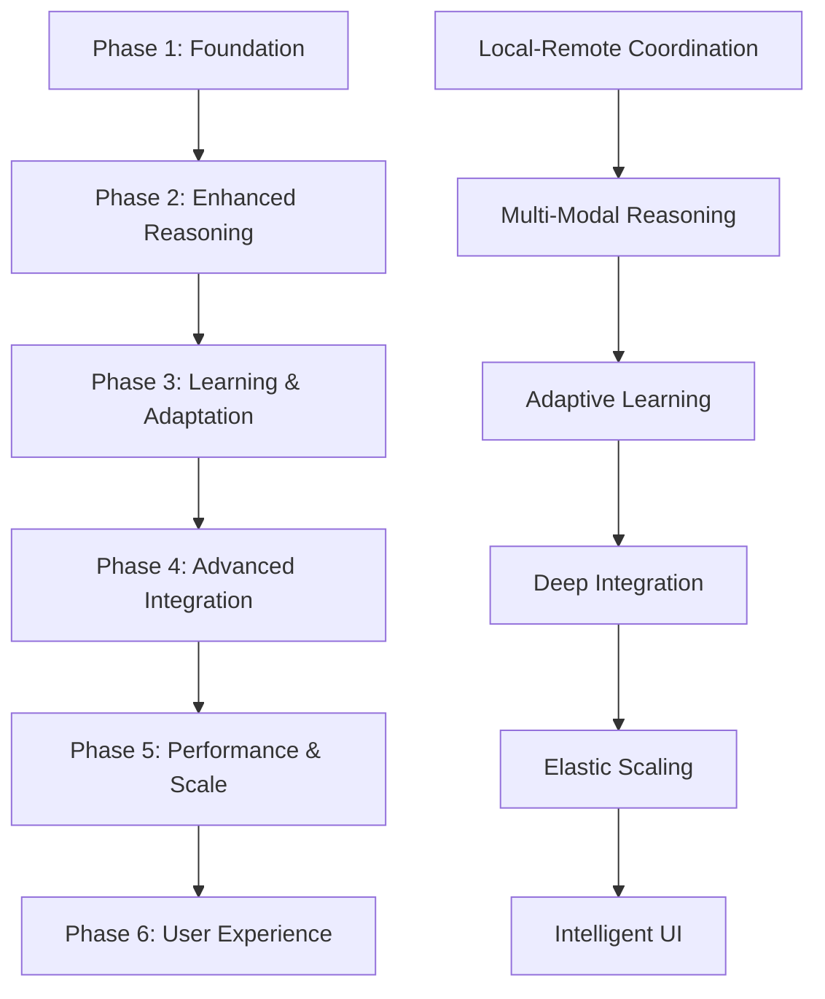

# Golem-Minotaur Interface Specification
**Detailed Interface Design for 6-Phase Implementation**

**Version:** 1.0  
**Date:** December 2024  
**Location:** Near Golem.UI.Plugin code for reference

## Overview

This document specifies the detailed interface between Golem and Minotaur for the 6-phase implementation roadmap. It outlines the exact integration points, required Minotaur adjustments, and interface evolution across each phase.

## Current Interface (Baseline)

### Core Plugin Interface

```csharp
// Current: Golem.UI.Plugin.GolemMinotaurPlugin
public class GolemMinotaurPlugin : IRuntimePluggableComponent
{
    // Current Integration Points
    Task<bool> InitializeAsync();
    Task<GolemTransformationCapabilities> GetTransformationCapabilitiesAsync();
    Task<string> StartTransformationAsync(TransformationRequest request);
    Task<TransformationStatus> GetTransformationStatusAsync(string transformationId);
}

// Current: Basic transformation capabilities
public class GolemTransformationCapabilities
{
    List<string> SupportedTransformations;
    List<string> Features;
    List<string> IntegrationPoints;
}
```

### Current Minotaur Integration Points

1. **CognitiveGraph Integration**: Direct access to parsed code structure
2. **RuntimePluggableComponent**: Plugin lifecycle management
3. **Basic Transformation Pipeline**: Simple request/response pattern

---

## Phase 1: Foundation (Months 1-3)

### New Golem Interfaces

```csharp
// Phase 1: Distributed GSSM Engine Integration
namespace Golem.Core.Distributed.Interfaces
{
    public interface ILocalGSSMAgent
    {
        Task<GSSMResult> ProcessRequestAsync(GSSMRequest request, ProcessingOptions? options = null);
        Task<AgentStatus> GetStatusAsync();
        Task<SynchronizationResult> SynchronizeStateAsync(SynchronizationOptions? options = null);
    }
    
    public interface IRemoteGSSMCoordinator  
    {
        Task<GSSMResult> ProcessDistributedTaskAsync(DistributedGSSMTask task, ProcessingOptions options);
        Task<ResourceAllocation> AllocateResourcesAsync(ResourceRequest request);
        Task<EngineHealthReport> GetEngineHealthAsync();
    }
}

// Phase 1: Enhanced Plugin Interface
public interface IDistributedGolemPlugin : IRuntimePluggableComponent
{
    // Existing functionality
    Task<bool> InitializeAsync();
    Task<GolemTransformationCapabilities> GetTransformationCapabilitiesAsync();
    
    // New distributed functionality
    Task<ILocalGSSMAgent> GetLocalAgentAsync();
    Task<bool> ConnectToRemoteCoordinatorAsync(string coordinatorUrl);
    Task<ProcessingStrategy> DetermineOptimalStrategyAsync(GSSMRequest request);
}
```

### Required Minotaur Adjustments - Phase 1

#### 1. Enhanced CognitiveGraph Extensions

**File**: `Minotaur/src/Minotaur/Core/CognitiveGraphNode.cs`

```csharp
// ADD: Distributed processing metadata
public class CognitiveGraphNode
{
    // Existing properties...
    
    // NEW: Distributed processing support
    public DistributedMetadata? DistributedInfo { get; set; }
    public List<ProcessingHint> ProcessingHints { get; set; } = new();
    
    // NEW: GSSM integration markers
    public GSSMStateMarker? StateMarker { get; set; }
}

public class DistributedMetadata
{
    public ComplexityLevel EstimatedComplexity { get; set; }
    public List<string> RequiredCapabilities { get; set; } = new();
    public Dictionary<string, object> ProcessingHints { get; set; } = new();
}
```

#### 2. GraphQL API Extensions

**File**: `Minotaur/src/Minotaur.UI.Blazor/Api/GraphQL/Query.cs`

```csharp
// ADD: Distributed GSSM operations
public class Query
{
    // Existing queries...
    
    // NEW: Distributed processing queries
    [UseProjection]
    public async Task<DistributedProcessingStatusDto> GetDistributedProcessingStatus(
        [Service] IDistributedGSSMEngine engine,
        string requestId)
    {
        return await engine.GetProcessingStatusAsync(requestId);
    }
    
    [UseProjection] 
    public async Task<IEnumerable<EngineCapabilityDto>> GetAvailableEngineCapabilities(
        [Service] IRemoteGSSMCoordinator coordinator)
    {
        var engines = await coordinator.GetAvailableEnginesAsync();
        return engines.Select(e => MapToCapabilityDto(e));
    }
}
```

#### 3. Plugin Manager Extensions

**File**: `Minotaur/src/Minotaur/Plugins/LanguagePluginManager.cs`

```csharp
// MODIFY: Support for distributed plugins
public class LanguagePluginManager
{
    // Existing methods...
    
    // NEW: Distributed plugin support
    public async Task<bool> RegisterDistributedPluginAsync(IDistributedGolemPlugin plugin)
    {
        // Register plugin with distributed capabilities
        await plugin.InitializeAsync();
        
        // Setup remote coordination if available
        if (!string.IsNullOrEmpty(_configuration.RemoteCoordinatorUrl))
        {
            await plugin.ConnectToRemoteCoordinatorAsync(_configuration.RemoteCoordinatorUrl);
        }
        
        return true;
    }
}
```

---

## Phase 2: Enhanced Reasoning (Months 4-6)

### New Golem Interfaces

```csharp
// Phase 2: Multi-Modal Reasoning
namespace Golem.Core.Reasoning.Interfaces
{
    public interface IMultiModalReasoningEngine
    {
        Task<ReasoningResult> ReasonAsync(ReasoningContext context, ReasoningOptions options);
        Task<IEnumerable<ReasoningMode>> GetAvailableModesAsync();
        Task<ReasoningStrategy> SelectOptimalStrategyAsync(ReasoningContext context);
    }
    
    public interface IPredictiveCodeIntelligence
    {
        Task<CodePrediction> PredictCodeIssuesAsync(CognitiveGraphNode graph);
        Task<PerformanceInsights> AnalyzePerformanceAsync(CognitiveGraphNode graph);
        Task<SecurityAssessment> AssessSecurityAsync(CognitiveGraphNode graph);
    }
}

// Phase 2: Enhanced Plugin Interface  
public interface IReasoningAwareGolemPlugin : IDistributedGolemPlugin
{
    Task<IMultiModalReasoningEngine> GetReasoningEngineAsync();
    Task<ReasoningCapabilities> GetReasoningCapabilitiesAsync();
    Task<IPredictiveCodeIntelligence> GetPredictiveIntelligenceAsync();
}
```

### Required Minotaur Adjustments - Phase 2

#### 1. Enhanced CognitiveGraph with Reasoning Metadata

**File**: `Minotaur/src/Minotaur/Core/CognitiveGraphNode.cs`

```csharp
// ADD: Reasoning and prediction metadata
public class CognitiveGraphNode
{
    // Existing + Phase 1 properties...
    
    // NEW: Reasoning metadata
    public ReasoningMetadata? ReasoningInfo { get; set; }
    public List<PredictionResult> Predictions { get; set; } = new();
    public QualityMetrics? QualityAssessment { get; set; }
}

public class ReasoningMetadata
{
    public ReasoningComplexity Complexity { get; set; }
    public List<ReasoningMode> ApplicableModes { get; set; } = new();
    public Dictionary<string, double> ConfidenceScores { get; set; } = new();
    public DateTime LastAnalyzed { get; set; }
}
```

#### 2. Real-time Analysis API

**File**: `Minotaur/src/Minotaur.UI.Blazor/Api/GraphQL/Subscription.cs`

```csharp
// ADD: Real-time reasoning subscriptions
public class Subscription
{
    // NEW: Real-time analysis updates
    [Subscribe]
    public async IAsyncEnumerable<ReasoningProgressDto> OnReasoningProgress(
        [Service] IMultiModalReasoningEngine reasoningEngine,
        string analysisId)
    {
        await foreach (var progress in reasoningEngine.SubscribeToProgressAsync(analysisId))
        {
            yield return MapToDto(progress);
        }
    }
    
    [Subscribe]
    public async IAsyncEnumerable<PredictionUpdateDto> OnPredictionUpdates(
        [Service] IPredictiveCodeIntelligence intelligence,
        string graphNodeId)
    {
        await foreach (var prediction in intelligence.SubscribeToPredictionsAsync(graphNodeId))
        {
            yield return MapToDto(prediction);
        }
    }
}
```

#### 3. UI Component Integration

**File**: `Minotaur/src/Minotaur.UI.Blazor/Components/Analysis/`

```razor
@* NEW: Reasoning Analysis Component *@
<ReasoningAnalysisPanel @bind-GraphNode="@CurrentNode" 
                       @bind-ReasoningEngine="@ReasoningEngine"
                       OnAnalysisComplete="@HandleAnalysisComplete" />

@* NEW: Predictive Intelligence Widget *@
<PredictiveIntelligenceWidget @bind-Predictions="@CurrentPredictions"
                             @bind-GraphNode="@CurrentNode" />
```

---

## Phase 3: Learning & Adaptation (Months 7-9)

### New Golem Interfaces

```csharp
// Phase 3: Learning and Adaptation
namespace Golem.Core.Learning.Interfaces
{
    public interface IAdaptiveLearningEngine
    {
        Task<LearningResult> ProcessLearningEventAsync(LearningEvent learningEvent);
        Task<UserProfile> GetUserProfileAsync(string userId);
        Task<AdaptationStrategy> GenerateAdaptationStrategyAsync(LearningContext context);
    }
    
    public interface IPersonalizationEngine
    {
        Task<PersonalizedRecommendations> GetRecommendationsAsync(string userId, CognitiveGraphNode context);
        Task<InterfaceConfiguration> GetPersonalizedInterfaceAsync(string userId);
        Task RecordUserInteractionAsync(string userId, UserInteraction interaction);
    }
}

// Phase 3: Learning-Aware Plugin Interface
public interface ILearningAwareGolemPlugin : IReasoningAwareGolemPlugin
{
    Task<IAdaptiveLearningEngine> GetLearningEngineAsync();
    Task<IPersonalizationEngine> GetPersonalizationEngineAsync();
    Task RecordUserFeedbackAsync(string userId, FeedbackEvent feedback);
}
```

### Required Minotaur Adjustments - Phase 3

#### 1. User Context and Learning Integration

**File**: `Minotaur/src/Minotaur/Core/UserContext.cs`

```csharp
// NEW: User learning and personalization context
public class UserContext
{
    public string UserId { get; set; } = string.Empty;
    public UserProfile Profile { get; set; } = new();
    public List<LearningEvent> LearningHistory { get; set; } = new();
    public PersonalizationSettings Settings { get; set; } = new();
    public DateTime LastInteraction { get; set; }
}

public class UserProfile
{
    public string UserId { get; set; } = string.Empty;
    public SkillLevel ExpertiseLevel { get; set; }
    public List<string> PreferredLanguages { get; set; } = new();
    public Dictionary<string, double> ToolUsagePatterns { get; set; } = new();
    public AdaptationPreferences Preferences { get; set; } = new();
}
```

#### 2. Learning Event Tracking

**File**: `Minotaur/src/Minotaur.UI.Blazor/Services/UserInteractionService.cs`

```csharp
// NEW: Service to track user interactions for learning
public class UserInteractionService : IUserInteractionService
{
    private readonly ILearningAwareGolemPlugin _golemPlugin;
    private readonly ILogger<UserInteractionService> _logger;
    
    public async Task RecordInteractionAsync(UserInteraction interaction)
    {
        // Track user interaction patterns
        await _golemPlugin.RecordUserFeedbackAsync(interaction.UserId, 
            MapToFeedbackEvent(interaction));
            
        // Update user context
        await UpdateUserContextAsync(interaction);
    }
    
    public async Task<PersonalizedRecommendations> GetRecommendationsAsync(string userId, string context)
    {
        var personalizationEngine = await _golemPlugin.GetPersonalizationEngineAsync();
        return await personalizationEngine.GetRecommendationsAsync(userId, ParseContext(context));
    }
}
```

#### 3. Adaptive UI Framework

**File**: `Minotaur/src/Minotaur.UI.Blazor/Components/Adaptive/`

```razor
@* NEW: Adaptive interface components *@
@inherits AdaptiveComponentBase

<AdaptiveToolbar @bind-UserProfile="@CurrentUser.Profile" 
                @bind-Configuration="@InterfaceConfig"
                OnConfigurationChanged="@HandleConfigChange" />

<AdaptiveCodeEditor @bind-Content="@CodeContent"
                   @bind-PersonalizationSettings="@PersonalizationSettings"
                   @bind-Recommendations="@CurrentRecommendations" />
```

---

## Phase 4: Advanced Integration (Months 10-12)

### New Golem Interfaces

```csharp
// Phase 4: Deep Minotaur Integration
namespace Golem.Core.Integration.Interfaces
{
    public interface IDeepMinotaurIntegration
    {
        Task<EnhancedCognitiveGraph> CreateEnhancedGraphAsync(CognitiveGraphNode sourceGraph);
        Task<IntegratedAnalysisResult> PerformIntegratedAnalysisAsync(EnhancedCognitiveGraph graph);
        Task<CollaborationSession> StartCollaborationSessionAsync(CollaborationRequest request);
    }
    
    public interface IDevOpsIntegration
    {
        Task<CIpipelineIntegration> IntegrateWithCIPipelineAsync(PipelineConfiguration config);
        Task<CodeReviewAssistant> GetCodeReviewAssistantAsync();
        Task<DeploymentStrategy> GenerateDeploymentStrategyAsync(DeploymentContext context);
    }
}

// Phase 4: Fully Integrated Plugin Interface
public interface IIntegratedGolemPlugin : ILearningAwareGolemPlugin
{
    Task<IDeepMinotaurIntegration> GetDeepIntegrationAsync();
    Task<IDevOpsIntegration> GetDevOpsIntegrationAsync();
    Task<CollaborationCapabilities> GetCollaborationCapabilitiesAsync();
}
```

### Required Minotaur Adjustments - Phase 4

#### 1. Enhanced CognitiveGraph Architecture

**File**: `Minotaur/src/Minotaur/Core/EnhancedCognitiveGraph.cs`

```csharp
// NEW: Enhanced CognitiveGraph with deep Golem integration
public class EnhancedCognitiveGraph : CognitiveGraphNode
{
    // Existing CognitiveGraphNode properties...
    
    // NEW: Deep integration features
    public IntegrationMetadata Integration { get; set; } = new();
    public List<CrossReferenceLink> CrossReferences { get; set; } = new();
    public CollaborationContext? Collaboration { get; set; }
    public ContinuousAnalysisState? ContinuousAnalysis { get; set; }
}

public class IntegrationMetadata
{
    public string GolemEngineVersion { get; set; } = string.Empty;
    public List<string> ActiveCapabilities { get; set; } = new();
    public Dictionary<string, object> IntegrationState { get; set; } = new();
    public DateTime LastSyncWithGolem { get; set; }
}
```

#### 2. Collaborative Editing Framework

**File**: `Minotaur/src/Minotaur.UI.Blazor/Hubs/CollaborationHub.cs`

```csharp
// NEW: Real-time collaboration hub
public class CollaborationHub : Hub<ICollaborationClient>
{
    private readonly IIntegratedGolemPlugin _golemPlugin;
    
    public async Task JoinCollaborationSession(string sessionId, string userId)
    {
        var integration = await _golemPlugin.GetDeepIntegrationAsync();
        var session = await integration.StartCollaborationSessionAsync(new CollaborationRequest
        {
            SessionId = sessionId,
            UserId = userId,
            JoinTime = DateTime.UtcNow
        });
        
        await Groups.AddToGroupAsync(Context.ConnectionId, sessionId);
        await Clients.Group(sessionId).UserJoined(userId, session.Participants);
    }
    
    public async Task PropagateCodeChange(string sessionId, CodeChangeEvent changeEvent)
    {
        // Broadcast change to all participants except sender
        await Clients.OthersInGroup(sessionId).CodeChanged(changeEvent);
        
        // Process change through Golem for intelligent assistance
        var integration = await _golemPlugin.GetDeepIntegrationAsync();
        var suggestions = await integration.ProcessCollaborativeChangeAsync(changeEvent);
        
        if (suggestions.Any())
        {
            await Clients.Group(sessionId).SuggestionsAvailable(suggestions);
        }
    }
}
```

#### 3. DevOps Pipeline Integration

**File**: `Minotaur/src/Minotaur.DevOps/Integration/GolemPipelineIntegration.cs`

```csharp
// NEW: DevOps pipeline integration
public class GolemPipelineIntegration : IPipelineStage
{
    private readonly IIntegratedGolemPlugin _golemPlugin;
    
    public async Task<PipelineStageResult> ExecuteAsync(PipelineContext context)
    {
        var devOpsIntegration = await _golemPlugin.GetDevOpsIntegrationAsync();
        
        // Integrate with CI pipeline
        var ciIntegration = await devOpsIntegration.IntegrateWithCIPipelineAsync(context.Configuration);
        
        // Perform automated code review
        var codeReviewAssistant = await devOpsIntegration.GetCodeReviewAssistantAsync();
        var reviewResults = await codeReviewAssistant.ReviewChangesAsync(context.Changes);
        
        // Generate deployment strategy
        var deploymentStrategy = await devOpsIntegration.GenerateDeploymentStrategyAsync(context.DeploymentContext);
        
        return new PipelineStageResult
        {
            Success = true,
            ReviewResults = reviewResults,
            DeploymentStrategy = deploymentStrategy,
            Recommendations = await GenerateRecommendationsAsync(context)
        };
    }
}
```

---

## Phase 5: Performance & Scale (Months 13-15)

### New Golem Interfaces

```csharp
// Phase 5: Performance and Scalability
namespace Golem.Core.Performance.Interfaces
{
    public interface IPerformanceOptimizedEngine
    {
        Task<OptimizedProcessingResult> ProcessWithOptimizationAsync(ProcessingRequest request);
        Task<PerformanceMetrics> GetPerformanceMetricsAsync();
        Task<ScalingRecommendations> GetScalingRecommendationsAsync();
    }
    
    public interface IElasticResourceManager
    {
        Task<ResourceAllocation> AllocateResourcesAsync(ResourceDemand demand);
        Task<ScalingDecision> EvaluateScalingNeedsAsync();
        Task<CostOptimization> OptimizeCostsAsync(UsagePattern usage);
    }
}

// Phase 5: Performance-Optimized Plugin Interface
public interface IPerformanceOptimizedGolemPlugin : IIntegratedGolemPlugin
{
    Task<IPerformanceOptimizedEngine> GetOptimizedEngineAsync();
    Task<IElasticResourceManager> GetResourceManagerAsync();
    Task<PerformanceProfile> GetPerformanceProfileAsync();
}
```

### Required Minotaur Adjustments - Phase 5

#### 1. Performance Monitoring Integration

**File**: `Minotaur/src/Minotaur/Performance/PerformanceMonitor.cs`

```csharp
// NEW: Integrated performance monitoring
public class IntegratedPerformanceMonitor : IPerformanceMonitor
{
    private readonly IPerformanceOptimizedGolemPlugin _golemPlugin;
    private readonly IMetricsCollector _metricsCollector;
    
    public async Task<PerformanceReport> GenerateIntegratedReportAsync()
    {
        // Collect Minotaur performance metrics
        var minotaurMetrics = await _metricsCollector.CollectMinotaurMetricsAsync();
        
        // Get Golem performance metrics
        var optimizedEngine = await _golemPlugin.GetOptimizedEngineAsync();
        var golemMetrics = await optimizedEngine.GetPerformanceMetricsAsync();
        
        // Generate integrated performance report
        return new IntegratedPerformanceReport
        {
            MinotaurMetrics = minotaurMetrics,
            GolemMetrics = golemMetrics,
            IntegrationEfficiency = CalculateIntegrationEfficiency(minotaurMetrics, golemMetrics),
            ScalingRecommendations = await optimizedEngine.GetScalingRecommendationsAsync()
        };
    }
}
```

#### 2. Elastic Scaling Framework

**File**: `Minotaur/src/Minotaur/Scaling/ElasticScalingManager.cs`

```csharp
// NEW: Elastic scaling coordination with Golem
public class ElasticScalingManager : IScalingManager
{
    private readonly IPerformanceOptimizedGolemPlugin _golemPlugin;
    
    public async Task<ScalingAction> DetermineScalingActionAsync(SystemLoad currentLoad)
    {
        var resourceManager = await _golemPlugin.GetResourceManagerAsync();
        var scalingDecision = await resourceManager.EvaluateScalingNeedsAsync();
        
        // Coordinate scaling between Minotaur and Golem
        return new ScalingAction
        {
            MinotaurScaling = DetermineMinotaurScaling(currentLoad),
            GolemScaling = scalingDecision,
            CoordinatedStrategy = CoordinateScaling(currentLoad, scalingDecision)
        };
    }
}
```

---

## Phase 6: User Experience (Months 16-18)

### New Golem Interfaces

```csharp
// Phase 6: Enhanced User Experience
namespace Golem.Core.UserExperience.Interfaces
{
    public interface IIntelligentUserInterface
    {
        Task<AdaptiveUIConfiguration> GenerateUIConfigurationAsync(UserContext context);
        Task<NaturalLanguageProcessor> GetNLProcessorAsync();
        Task<VisualAnalyticsEngine> GetVisualAnalyticsAsync();
    }
    
    public interface ICollaborationEngine
    {
        Task<CollaborationSession> CreateSessionAsync(CollaborationRequest request);
        Task<TeamInsights> GenerateTeamInsightsAsync(string teamId);
        Task<KnowledgeTransferPlan> GenerateKnowledgeTransferAsync(KnowledgeTransferRequest request);
    }
}

// Phase 6: Complete Plugin Interface
public interface ICompleteGolemPlugin : IPerformanceOptimizedGolemPlugin
{
    Task<IIntelligentUserInterface> GetIntelligentUIAsync();
    Task<ICollaborationEngine> GetCollaborationEngineAsync();
    Task<CompletePlatformCapabilities> GetPlatformCapabilitiesAsync();
}
```

### Required Minotaur Adjustments - Phase 6

#### 1. Intelligent UI Framework

**File**: `Minotaur/src/Minotaur.UI.Blazor/Components/Intelligent/`

```razor
@* NEW: AI-powered intelligent interface *@
<IntelligentWorkspace @bind-UserContext="@CurrentUserContext"
                     @bind-ProjectContext="@CurrentProject"
                     @bind-GolemPlugin="@GolemPlugin">
    
    <NaturalLanguageQueryPanel @bind-QueryProcessor="@NLProcessor" 
                              OnQuerySubmitted="@HandleNLQuery" />
    
    <AdaptiveCodeVisualization @bind-CognitiveGraph="@CurrentGraph"
                              @bind-VisualizationEngine="@VisualEngine" />
    
    <CollaborativeWorkspace @bind-Session="@CollaborationSession"
                           @bind-TeamMembers="@TeamMembers" />
    
</IntelligentWorkspace>
```

#### 2. Natural Language Interface

**File**: `Minotaur/src/Minotaur/NaturalLanguage/MinotaurNLInterface.cs`

```csharp
// NEW: Natural language interface integration
public class MinotaurNLInterface : INaturalLanguageInterface
{
    private readonly ICompleteGolemPlugin _golemPlugin;
    
    public async Task<NLQueryResult> ProcessNaturalLanguageQueryAsync(string query, QueryContext context)
    {
        var intelligentUI = await _golemPlugin.GetIntelligentUIAsync();
        var nlProcessor = await intelligentUI.GetNLProcessorAsync();
        
        // Process natural language query
        var processingResult = await nlProcessor.ProcessQueryAsync(query, context);
        
        // Execute corresponding actions in Minotaur
        var actionResults = await ExecuteMinotaurActionsAsync(processingResult.Actions);
        
        return new NLQueryResult
        {
            Query = query,
            ProcessingResult = processingResult,
            ActionResults = actionResults,
            GeneratedResponse = await GenerateResponseAsync(processingResult, actionResults)
        };
    }
}
```

#### 3. Comprehensive Analytics Dashboard

**File**: `Minotaur/src/Minotaur.UI.Blazor/Pages/Analytics/ComprehensiveDashboard.razor`

```razor
@page "/analytics/comprehensive"
@using Golem.Core.UserExperience.Interfaces

<PageTitle>Comprehensive Analytics Dashboard</PageTitle>

<div class="comprehensive-dashboard">
    <ProjectHealthOverview @bind-ProjectMetrics="@ProjectMetrics" 
                          @bind-AnalyticsEngine="@AnalyticsEngine" />
    
    <TeamCollaborationInsights @bind-TeamInsights="@TeamInsights"
                              @bind-CollaborationEngine="@CollaborationEngine" />
    
    <CodeQualityTrends @bind-QualityMetrics="@QualityMetrics"
                       @bind-TimeRange="@SelectedTimeRange" />
    
    <LearningProgressVisualization @bind-LearningData="@LearningData"
                                  @bind-UserProfiles="@UserProfiles" />
    
    <PredictiveInsightsPanels @bind-Predictions="@CurrentPredictions"
                             @bind-RecommendedActions="@Recommendations" />
</div>
```

---

## Interface Evolution Summary

### Phase Dependencies



### Interface Compatibility Matrix

| Phase | Minotaur Changes Required | Backward Compatible | New Capabilities |
|-------|---------------------------|-------------------|------------------|
| Phase 1 | CognitiveGraph extensions, GraphQL API | ✅ Yes | Distributed processing |
| Phase 2 | Reasoning metadata, Real-time APIs | ✅ Yes | Predictive intelligence |
| Phase 3 | User context, Learning services | ✅ Yes | Personalization |
| Phase 4 | Enhanced graph, Collaboration hubs | ⚠️ Minor breaking changes | Deep integration |
| Phase 5 | Performance monitoring integration | ✅ Yes | Elastic scaling |
| Phase 6 | UI framework, NL interface | ⚠️ Minor breaking changes | Intelligent UX |

### Critical Integration Points

1. **CognitiveGraph Enhancement**: Progressive enhancement without breaking existing functionality
2. **Plugin Interface Evolution**: Backward-compatible interface expansion
3. **Real-time Communication**: New SignalR hubs and GraphQL subscriptions
4. **User Context Integration**: New user tracking and personalization systems
5. **Performance Coordination**: Integrated monitoring and scaling decisions

---

## Implementation Guidelines

### For Minotaur Development Team

1. **Phase 1**: Focus on CognitiveGraph extensions and basic plugin integration
2. **Phase 2**: Add reasoning metadata and real-time analysis capabilities  
3. **Phase 3**: Implement user context tracking and learning event collection
4. **Phase 4**: Develop collaboration infrastructure and enhanced graph capabilities
5. **Phase 5**: Integrate performance monitoring and elastic scaling coordination
6. **Phase 6**: Build intelligent UI framework and natural language interface

### For Golem Development Team

1. Implement interfaces progressively, maintaining backward compatibility
2. Ensure all new capabilities are optional and gracefully degrade
3. Provide migration tools for each phase transition
4. Document all breaking changes and provide upgrade paths
5. Test integration at each phase boundary

### Testing Strategy

1. **Integration Tests**: Test each interface at phase boundaries
2. **Compatibility Tests**: Ensure backward compatibility is maintained
3. **Performance Tests**: Verify performance doesn't degrade with new capabilities
4. **User Acceptance Tests**: Validate user experience improvements in each phase

This specification provides the detailed roadmap for implementing the Golem-Minotaur integration across all six phases while maintaining system stability and user experience.