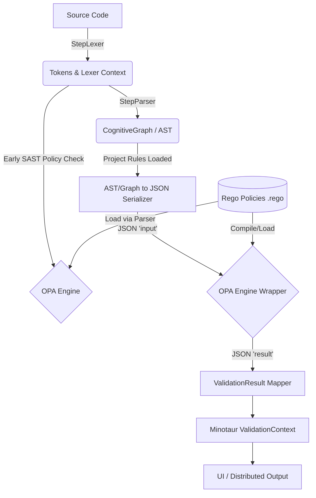

# Technical Design Specification: Minotaur OPA (Rego) Verification

## 1. Executive Summary
This document outlines the technical design for integrating the **Open Policy Agent (OPA)** and its policy language, **Rego**, into the **Minotaur** parsing and validation engine.

Currently, Minotaur utilizes language-specific C# visitor classes (e.g., `JavaValidationVisitor`, `GoValidationVisitor`) to enforce syntax and semantic rules. By incorporating OPA, Minotaur will allow users to define general, language-specific, and usage-specific verification rules dynamically as code. This decouples the validation logic from the core compiler-compiler engine, enabling live rule updates, sharing via the Minotaur Marketplace, and cross-language policy enforcement.

Furthermore, this integration will leverage the existing `StepLexer` and `StepParser` to load project-specific OPA rules alongside the standard processing pipeline, extending OPA's reach into Static Application Security Testing (SAST) and more generalized structural validation across the `CognitiveGraph`.

## 2. Motivation & Goals
* **Extensibility:** Allow end-users to write custom validation rules (e.g., "Disallow `unsafe` blocks in Rust", "Enforce naming conventions in Go") without modifying Minotaur's C# source code.
* **Unification:** Standardize the `ValidationResult` generation across all plugins in `Minotaur.Plugins.*`.
* **Performance:** Ensure rule evaluation remains performant, especially when integrated into `Minotaur.Distributed` processing pipelines.
* **UI Integration:** Expose OPA rule authoring and violation reporting in the `Minotaur.UI.Blazor` interface.
* **Early Evaluation:** Integrate policy loading and early-stage SAST rules directly into the `StepLexer` and `StepParser` phases before deep graph traversal.

## 3. Architecture

### 3.1. High-Level Component Interaction

To evaluate an AST against OPA, Minotaur must serialize its in-memory tree (or graph representation) into a JSON document (`input`), evaluate it against the loaded Rego policies (`data`), and map the JSON response back to `Minotaur.Validation.ValidationResult` objects.



### 3.2. Evaluation Engine Strategy
Calling out to an external OPA REST API per file would introduce unacceptable latency for a high-performance parser. Instead, Minotaur will use **WASM (WebAssembly) compiled Rego policies** executed entirely in-process using a C# WASM runtime (like `Wasmtime` via `Opa.Wasm`).

### 3.3. Integration with StepLexer and StepParser
The `StepLexer` and `StepParser` will be enhanced to support loading `.rego` files discovered within the target project's directory structure (e.g., a `.minotaur/policies` folder).

*   **StepLexer:** Can evaluate token streams against basic structural or regex-based policies early in the pipeline (e.g., detecting hardcoded secrets before full AST construction).
*   **StepParser:** Will bundle project-specific Rego rules with the generated `CognitiveGraph` to provide context-aware SAST and structural validation.

## 4. Detailed Component Design

### 4.1. The `IOpaVerificationEngine`
A new service residing in `Minotaur.Core.Services.Validation` that manages the lifecycle of OPA policies.

```csharp
namespace Minotaur.Core.Services.Validation
{
    public interface IOpaVerificationEngine
    {
        // Loads a pre-compiled OPA WASM bundle or raw Rego files
        Task LoadPoliciesAsync(IEnumerable<string> regoRulePaths);
        
        // Evaluates the AST/CognitiveGraph against the loaded policies
        Task<IEnumerable<ValidationResult>> EvaluateAsync(SyntaxNode rootNode, ValidationContext context);
        
        // Overload for early token-stream evaluation
        Task<IEnumerable<ValidationResult>> EvaluateTokensAsync(IEnumerable<StepToken> tokens, ValidationContext context);
    }
}
```

### 4.2. AST/Graph Serialization Model (`input` schema)
For OPA to process Minotaur's AST or `CognitiveGraph`, we need a standard JSON representation. `SyntaxNode` objects will be flattened or hierarchically mapped.

**Example OPA Input (`input`):**
```json
{
  "language": "java",
  "fileName": "AuthService.java",
  "projectPolicies": ["rule1.rego", "rule2.rego"],
  "ast": {
    "type": "ClassDeclaration",
    "name": "AuthService",
    "children": [
      {
        "type": "MethodDeclaration",
        "name": "authenticate",
        "modifiers": ["public"],
        "parameters": [...]
      }
    ]
  }
}
```

### 4.3. Rego Policy Structure
Policies will be structured to return an array of error objects. Minotaur will expect a specific output signature from the Rego queries (e.g., `data.minotaur.validation.errors`).

**Example Usage-Specific Rego Rule (`java_security.rego`):**
```rego
package minotaur.validation.java

# Deny methods named 'authenticate' that do not have the 'private' modifier
errors[{"nodeId": node.id, "message": msg, "severity": "Error"}] {
    input.language == "java"
    
    # Walk the AST to find MethodDeclarations
    node := walk_ast(input.ast)
    node.type == "MethodDeclaration"
    node.name == "authenticate"
    
    # Check if 'private' is missing
    not "private" in node.modifiers
    
    msg := sprintf("Security Violation: Method '%v' must be private.", [node.name])
}
```

### 4.4. Integration with `ValidationContext`
Currently, visitors like `JavaValidationVisitor` add errors directly to a context. The `OpaValidationProvider` will act as a universal visitor/validator, hooking into the `StepLexer` and `StepParser` outputs.

```csharp
public class OpaValidationProvider : IValidationProvider 
{
    private readonly IOpaVerificationEngine _opaEngine;

    public async Task ValidateAsync(SyntaxTree tree, ValidationContext context)
    {
        // Combine core policies with project-specific policies found during parsing
        var projectPolicies = tree.GetMetadata("LoadedPolicies"); 
        
        var opaResults = await _opaEngine.EvaluateAsync(tree.Root, context);
        foreach(var res in opaResults) 
        {
            context.AddResult(res); // Maps to Minotaur's existing ValidationResult
        }
    }
}
```

## 5. System Impact & Dependencies

1. **Minotaur.Core:** Needs new JSON serialization logic specifically tuned for ASTs and `CognitiveGraph` to avoid circular reference loops (Parent node pointers must be ignored).
2. **Minotaur.StepParser / Minotaur.StepLexer:** Must be updated to scan for and parse adjacent `.rego` files during the ingestion phase.
3. **Minotaur.Plugins:** Existing `*ValidationVisitor.cs` files can be gradually deprecated or migrated into default `.rego` files shipped with the plugins.
4. **Minotaur.UI.Blazor:** 
   * **Grammar Editor:** Add a "Policy Editor" tab for testing Rego rules against the AST.
   * **Syntax Highlighting:** Add Rego syntax highlighting to the `SyntaxHighlightingService.cs`.
5. **Nuget Dependencies:** 
   * `Opa.Wasm` (for in-process WASM evaluation).
   * `System.Text.Json` (for fast AST serialization).

## 6. Implementation Phases

* **Phase 1: Core Engine Integration**
  * Implement `AstJsonSerializer`.
  * Build the `OpaVerificationEngine` using `Opa.Wasm`.
  * Write unit tests in `Minotaur.Tests/Validation/OpaValidationTests.cs`.
* **Phase 2: Lexer & Parser Integration (SAST focus)**
  * Modify `StepLexer` and `StepParser` to discover and attach project-level `.rego` files to the parsing context.
  * Implement early token-stream validation for basic SAST checks.
* **Phase 3: Plugin Migration**
  * Migrate 1-2 existing C# Validation Visitors (e.g., `RustValidationVisitor.cs`) to Rego policies.
  * Benchmark performance to ensure JSON serialization + WASM execution is within acceptable ms limits per file.
* **Phase 4: UI & UX**
  * Integrate Monaco Editor for Rego in `Minotaur.UI.Blazor/Components/GrammarEditor/`.
  * Display OPA validation results seamlessly alongside standard parsing errors in the UI.